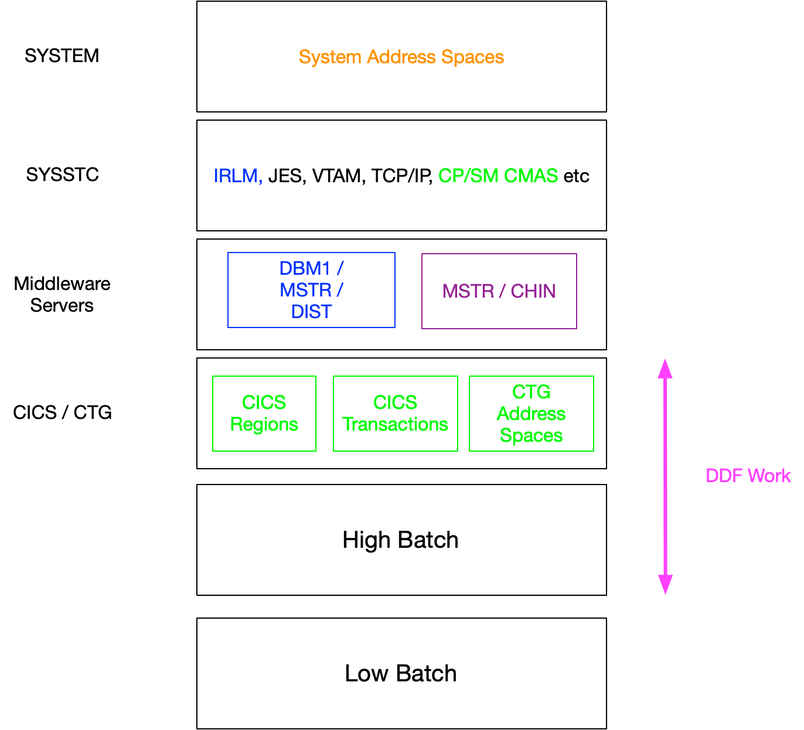

template: Martin Template.pptx

### Workload Manager Policies Should Follow The Model Policy
<!-- not md2pptx: contentsplit: 2 1 -->
<!-- not md2pptx: contentsplitdirection: h -->

* The tiering doesn't 100&percnt; imply Importance levels
  * But pretty close
* Some middleware might not be present
  * For example MQ
* DDF work is difficult to fit into this scheme
  * But remarkably flexibly <del>classified</del>classifiable