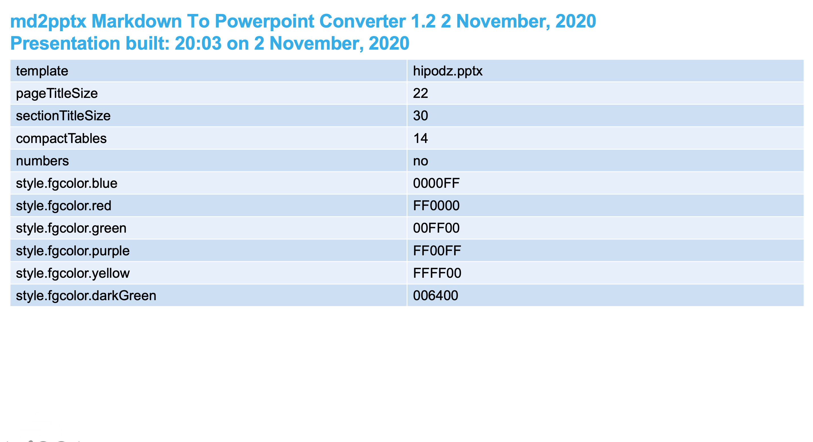
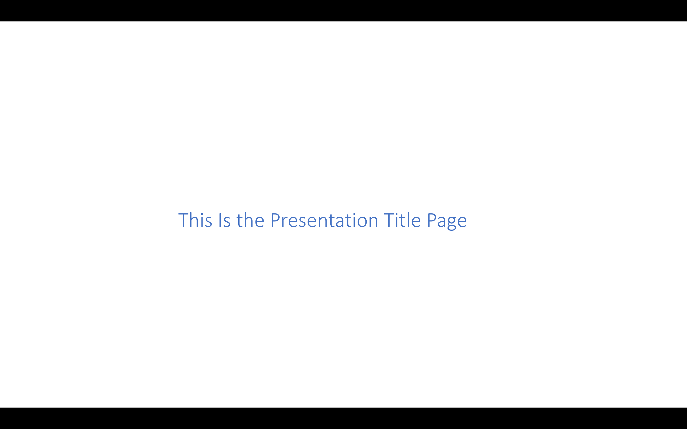
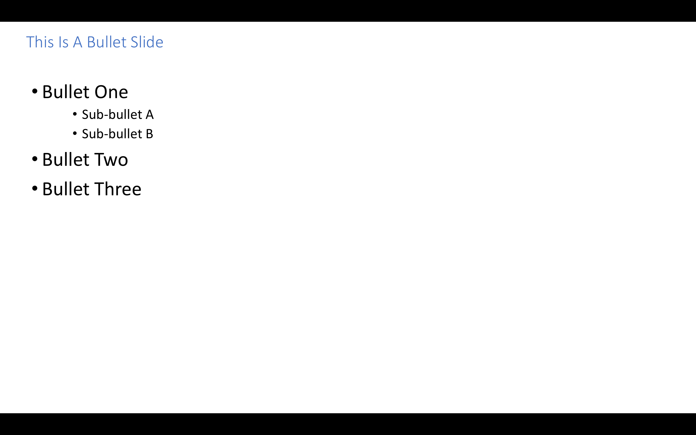

<style>
img {
  border: 2px solid #555 !important;
}
</style>


# Markdown To Powerpoint User Guide

This document describes the md2pptx Markdown preprocessor, which turns Markdown text into a Powerpoint presentation (whether .pptx or [.pptm](#invoking-a-vba-macro)).

In this document we'll refer to it as "md2pptx", pronounced "em dee to pee pee tee ex".

As you can see in the [change log](#change-log), md2pptx is frequently updated - both for bug fixes and enhancements.

### Table Of Contents

* [Why md2pptx?](#why-md2pptx)
	* [A Real World Use Case](#a-real-world-use-case)
	* [Using md2pptx With mdpre](#using-md2pptx-with-mdpre)
* [How Do You Use md2pptx?](#how-do-you-use-md2pptx)
	* [Installation](#installation)
	* [Updating](#updating)
	* [Use](#use)
* [python-pptx license](#pythonpptx-license)
* [Change Log](#change-log)
* [Creating Slides](#creating-slides)
	* [Presentation Title Slides](#presentation-title-slides)
	* [Presentation Section Slides](#presentation-section-slides)
	* [Bullet Slides](#bullet-slides)
		* [Numbered List Items](#numbered-list-items)
	* [Graphics, Video And Audio slides](#graphics-video-and-audio-slides)
		* [Graphics Slides](#graphics-slides)
			* [Clickable Pictures](#clickable-pictures)
			* [Graphics File References](#graphics-file-references)
		* [Video And Audio Slides](#video-and-audio-slides)
			* [Video Slides](#video-slides)
			* [Audio Slides](#audio-slides)
	* [Table Slides](#table-slides)
		* [Special Case: Two Graphics Side By Side](#special-case-two-graphics-side-by-side)
		* [Special Case: Two By Two Grid Of Graphics](#special-case-two-by-two-grid-of-graphics)
		* [Special Case: Three Graphics On A Slide](#special-case-three-graphics-on-a-slide)
		* [Special Case: One Graphic Above Another](#special-case-one-graphic-above-another)
		* [Multi-Column Table Cells](#multicolumn-table-cells)
	* [Card Slides](#card-slides)
		* [Card Titles](#card-titles)
		* [Card Graphics, Video, &amp; Audio](#card-graphics-video-&amp;-audio)
	* [Code Slides](#code-slides)
		* [`<code>`](#<code>)
		* [Triple Backticks (```)](#triple-backticks-())
			* [Special Processing Of Code Within Triple Backticks](#special-processing-of-code-within-triple-backticks)
				* [GraphViz](#graphviz)
		* [Indented Text](#indented-text)
		* [`<pre>`](#<pre>)
	* [Funnels](#funnels)
	* [Task List Slides](#task-list-slides)
	* [Slides With More Than One Content Block](#slides-with-more-than-one-content-block)
	* [Adding Slide Notes](#adding-slide-notes)
* [Slides Without Titles](#slides-without-titles)
	* [Using A Horizontal Rule](#using-a-horizontal-rule)
	* [Using A Level 3 Heading With `&nbsp;`](#using-a-level-3-heading-with-&nbsp;)
* [Hyperlinks And VBA Macros](#hyperlinks-and-vba-macros)
	* [Coding A URL Reference](#coding-a-url-reference)
	* [Coding A Heading Reference On A Target Slide](#coding-a-heading-reference-on-a-target-slide)
	* [Coding A Hyperlink To Another Slide](#coding-a-hyperlink-to-another-slide)
	* [Invoking A VBA  Macro](#invoking-a-vba-macro)
		* [Sample Macro To Remove The First Slide](#sample-macro-to-remove-the-first-slide)
		* [Sample Macro To Remove The First Slide And Save As A .pptx File](#sample-macro-to-remove-the-first-slide-and-save-as-a-pptx-file)
* [HTML Comments](#html-comments)
* [Special Text Formatting](#special-text-formatting)
	* [Using HTML `<span>` Elements To Specify Text Effects](#using-html-<span>-elements-to-specify-text-effects)
		* [Using HTML `<span>` Elements with `class`](#using-html-<span>-elements-with-class)
		* [Using HTML `<span>` Elements with `style`](#using-html-<span>-elements-with-style)
	* [HTML Entity References](#html-entity-references)
	* [Numeric Character References](#numeric-character-references)
	* [Escaped Characters](#escaped-characters)
	* [CriticMarkup](#criticmarkup)
* [Creating A Glossary Of Terms](#creating-a-glossary-of-terms)
* [Creating Footnotes](#creating-footnotes)
	* [Creating A Footnote](#creating-a-footnote)
	* [Referring To A Footnote](#referring-to-a-footnote)
* [Controlling The Presentation With Metadata](#controlling-the-presentation-with-metadata)
	* [Specifying Metadata](#specifying-metadata)
		* [Processing Summary](#processing-summary)
		* [Specifying Colours](#specifying-colours)
			* [Theme Colours](#theme-colours)
			* [RGB Colours](#rgb-colours)
	* [Metadata Keys](#metadata-keys)
		* [Title And Subtitle Font Sizes And Alignment](#title-and-subtitle-font-sizes-and-alignment)
			* [Page Title Size - `pageTitleSize`](#page-title-size-pagetitlesize)
			* [Page Subtitle Size - `pageSubtitleSize`](#page-subtitle-size-pagesubtitlesize)
			* [Section Title Size - `sectionTitleSize`](#section-title-size-sectiontitlesize)
			* [Section Subtitle Size - `sectionSubtitleSize`](#section-subtitle-size-sectionsubtitlesize)
			* [Presentation Title Size - `presTitleSize`](#presentation-title-size-prestitlesize)
			* [Presentation Subtitle Size - `presSubtitleSize`](#presentation-subtitle-size-pressubtitlesize)
			* [Page Title Alignment `pagetitlealign`](#page-title-alignment-pagetitlealign)
		* [Monospace Font - `monoFont`](#monospace-font-monofont)
		* [Margin size - `marginBase` and `tableMargin`](#margin-size-marginbase-and-tablemargin)
		* [Controlling Adjusting Title Positions And Sizes - `AdjustTitles`](#controlling-adjusting-title-positions-and-sizes-adjusttitles)
		* [Associating A Class Name with A Background Colour With `style.bgcolor`](#associating-a-class-name-with-a-background-colour-with-stylebgcolor)
		* [Associating A Class Name with A Foreground Colour With `style.fgcolor`](#associating-a-class-name-with-a-foreground-colour-with-stylefgcolor)
		* [Associating A Class Name With Text Emphasis With `style.emphasis`](#associating-a-class-name-with-text-emphasis-with-styleemphasis)
		* [Associating A Class Name With Font Size with `style.fontsize`](#associating-a-class-name-with-font-size-with-stylefontsize)
		* [Template Presentation - `template`](#template-presentation-template)
		* [Hiding Slides - `hidden`](#hiding-slides-hidden)
		* [Specifying An Abstract Slide With `abstractTitle`](#specifying-an-abstract-slide-with-abstracttitle)
		* [Specifying Text Size With `baseTextSize` And `baseTextDecrement`](#specifying-text-size-with-basetextsize-and-basetextdecrement)
		* [Specifying Bold And Italic Text Colour With `BoldColour` And `ItalicColour`](#specifying-bold-and-italic-text-colour-with-boldcolour-and-italiccolour)
		* [Specifying Bold And Italic Text Effects With `BoldBold` And `ItalicItalic`](#specifying-bold-and-italic-text-effects-with-boldbold-and-italicitalic)
		* [Controlling Task Slide Production With `taskSlides` and `tasksPerSlide`](#controlling-task-slide-production-with-taskslides-and-tasksperslide)
		* [Controlling Glossary Slide Production With `glossaryTitle`, `glossaryTerm`, `glossaryMeaning`,`glossaryMeaningWidth`, and `glossaryTermsPerPage`](#controlling-glossary-slide-production-with-glossarytitle-glossaryterm-glossarymeaningglossarymeaningwidth-and-glossarytermsperpage)
		* [Specifying How Many Spaces Represent An Indentation Level With `IndentSpaces`](#specifying-how-many-spaces-represent-an-indentation-level-with-indentspaces)
		* [Specifying Where Temporary Files Are Stored With `tempDir`](#specifying-where-temporary-files-are-stored-with-tempdir)
		* [Deleting The First (Processing Summary) Slide - with `DeleteFirstSlide`](#deleting-the-first-(processing-summary)-slide-with-deletefirstslide)
		* [Specifying Slide Background Images With `backgroundImage`](#specifying-slide-background-images-with-backgroundimage)
		* [Table Metadata](#table-metadata)
			* [Shrinking Tables With `compactTables`](#shrinking-tables-with-compacttables)
			* [Adjusting Table Heading Font Size With `tableHeadingSize`](#adjusting-table-heading-font-size-with-tableheadingsize)
			* [Adding Lines Round Tables And Cells With `addTableLines`](#adding-lines-round-tables-and-cells-with-addtablelines)
			* [Adding Lines After Table Rows And Columns With `addTableRowLines` And `addTableColumnLines`](#adding-lines-after-table-rows-and-columns-with-addtablerowlines-and-addtablecolumnlines)
			* [Specifying What The Added Table Lines Look Like With `addTableLineColour`, `addTableLineCount` and `addTableLineWidth`](#specifying-what-the-added-table-lines-look-like-with-addtablelinecolour-addtablelinecount-and-addtablelinewidth)
			* [Controlling Whether Empty Table Cells Cause Column Spanning - `SpanCells`](#controlling-whether-empty-table-cells-cause-column-spanning-spancells)
			* [Controlling Whether Tables Have Drop Shadows - `tableShadow`](#controlling-whether-tables-have-drop-shadows-tableshadow)
		* [Card Metadata](#card-metadata)
			* [Card Background Colour - `CardColour`](#card-background-colour-cardcolour)
			* [Card Border Colour - `CardBorderColour`](#card-border-colour-cardbordercolour)
			* [Card Border Width - `CardBorderWidth`](#card-border-width-cardborderwidth)
			* [Card Title Size - `CardTitleSize`](#card-title-size-cardtitlesize)
			* [Card Title Colour - `cardTitleColour`](#card-title-colour-cardtitlecolour)
			* [Card Title Background Colours - `CardTitleBackground`](#card-title-background-colours-cardtitlebackground)
			* [Card Divider Colour - `cardDividerColour`](#card-divider-colour-carddividercolour)
			* [Card Shadow - `CardShadow`](#card-shadow-cardshadow)
			* [Card Size - `CardPercent`](#card-size-cardpercent)
			* [Card Layout Direction - `CardLayout`](#card-layout-direction-cardlayout)
			* [Card Title Alignment - `CardTitleAlign`](#card-title-alignment-cardtitlealign)
			* [Card Title Position - `CardTitlePosition`](#card-title-position-cardtitleposition)
			* [Card Shape - `CardShape`](#card-shape-cardshape)
			* [Card Horizontal Gap - `CardHorizontalGap`](#card-horizontal-gap-cardhorizontalgap)
			* [Card Vertical Gap - `CardVerticalGap`](#card-vertical-gap-cardverticalgap)
			* [Card Graphic Position - `CardGraphicPosition`](#card-graphic-position-cardgraphicposition)
			* [Card Graphic Size - `CardGraphicSize`](#card-graphic-size-cardgraphicsize)
			* [Card Graphic Padding - `CardGraphicPadding`](#card-graphic-padding-cardgraphicpadding)
		* [Code Metadata](#code-metadata)
			* [Code Column Count - `CodeColumns`](#code-column-count-codecolumns)
			* [Fixed Pitch Height To Width Ratio - `FPRatio`](#fixed-pitch-height-to-width-ratio-fpratio)
			* [Foreground Colour - `CodeForeground`](#foreground-colour-codeforeground)
			* [Background Colour - `CodeBackground`](#background-colour-codebackground)
		* [Funnel Metadata](#funnel-metadata)
			* [Funnel Fill Colours - `funnelColours`](#funnel-fill-colours-funnelcolours)
			* [Funnel Border Colour - `funnelBorderColour`](#funnel-border-colour-funnelbordercolour)
			* [Funnel Title Colour - `funnelTitleColour`](#funnel-title-colour-funneltitlecolour)
			* [Funnel Text Colour - `funnelTextColour`](#funnel-text-colour-funneltextcolour)
			* [Funnel Labels Space - `funnelLabelsPercent`](#funnel-labels-space-funnellabelspercent)
			* [Funnel Labels Position - `funnelLabelsPosition`](#funnel-labels-position-funnellabelsposition)
			* [Funnel Orientation - `funnelWidest`](#funnel-orientation-funnelwidest)
		* [Footer And Slide Number Metadata](#footer-and-slide-number-metadata)
			* [Slide Numbers - `numbers`](#slide-numbers-numbers)
			* [Specifying Slide Number Font Size With `numbersFontSize`](#specifying-slide-number-font-size-with-numbersfontsize)
			* [Specifying How Much Space To Reserve For Slide Numbers With `NumbersHeight`](#specifying-how-much-space-to-reserve-for-slide-numbers-with-numbersheight)
			* [Specifying Footer Text](#specifying-footer-text)
				* [Footer Flexibility](#footer-flexibility)
			* [Specifying Footer Font Size With `footerFontSize`](#specifying-footer-font-size-with-footerfontsize)
		* [Slide Heading Levels - `TopHeadingLevel`](#slide-heading-levels-topheadinglevel)
		* [Slides With Multiple Content Blocks](#slides-with-multiple-content-blocks)
			* [Horizontal Or Vertical Split - `ContentSplitDirection`](#horizontal-or-vertical-split-contentsplitdirection)
			* [Split Proportions - `ContentSplit`](#split-proportions-contentsplit)
		* [Graphics Metadata](#graphics-metadata)
			* [Exporting Converted SVG And PNG Files - `exportGraphics`](#exporting-converted-svg-and-png-files-exportgraphics)
		* [Table Of Contents And Section Slide Metadata](#table-of-contents-and-section-slide-metadata)
			* ["Chevron Style" Table Of Contents](#chevron-style-table-of-contents)
			* ["Circle Style" Table Of Contents](#circle-style-table-of-contents)
			* ["Plain Style" Table Of Contents](#plain-style-table-of-contents)
			* [Table Of Contents Style - `tocStyle`](#table-of-contents-style-tocstyle)
			* [Table Of Contents Title - `tocTitle`](#table-of-contents-title-toctitle)
			* [Table Of Contents Live Links - `tocLinks`](#table-of-contents-live-links-toclinks)
			* [Table Of Contents Item Height - `TOCItemHeight`](#table-of-contents-item-height-tocitemheight)
			* [Table Of Contents Item Colour - `TOCItemColour`](#table-of-contents-item-colour-tocitemcolour)
			* [Table Of Contents Row Gap - `TOCRowGap`](#table-of-contents-row-gap-tocrowgap)
			* [Table Of Contents Font Size - `TOCFontSize`](#table-of-contents-font-size-tocfontsize)
			* [Section Navigation Buttons - `SectionArrows`](#section-navigation-buttons-sectionarrows)
			* [Section Navigation Button Colour - `SectionArrowsColour`](#section-navigation-button-colour-sectionarrowscolour)
			* [Make Expandable Sections - `SectionsExpand`](#make-expandable-sections-sectionsexpand)
		* [Slide Transitions - `Transition`](#slide-transitions-transition)
		* [Python Exit Routines](#python-exit-routines)
			* [After Loading - `onPresentationInitialisation`](#after-loading-onpresentationinitialisation)
			* [Before Saving - `onPresentationBeforeSave`](#before-saving-onpresentationbeforesave)
			* [After Saving - `onPresentationAfterSave`](#after-saving-onpresentationaftersave)
	* [Dynamic Metadata](#dynamic-metadata)
		* [`hidden`](#hidden)
		* [Tables](#tables)
			* [`CompactTables`](#compacttables)
			* [`TableHeadingSize`](#tableheadingsize)
			* [`addTableLines`](#addtablelines)
			* [`addTableColumnLines` And `addTableRowLines`](#addtablecolumnlines-and-addtablerowlines)
			* [Added Table Line Attributes](#added-table-line-attributes)
			* [`SpanCells`](#spancells)
		* [Cards](#cards)
			* [`CardPercent`](#cardpercent)
			* [`CardLayout`](#cardlayout)
			* [`CardColour`](#cardcolour)
			* [`CardTitleAlign`](#cardtitlealign)
			* [`CardTitlePosition`](#cardtitleposition)
			* [`CardTitleBackground`](#cardtitlebackground)
			* [`CardShape`](#cardshape)
			* [`CardHorizontalGap`](#cardhorizontalgap)
			* [`CardVerticalGap`](#cardverticalgap)
		* [Code](#code)
			* [`CodeColumns`](#codecolumns)
			* [`FPRatio`](#fpratio)
			* [`CodeForeground`](#codeforeground)
			* [`CodeBackground`](#codebackground)
		* [Funnel](#funnel)
			* [`FunnelColours`](#funnelcolours)
			* [`FunnelBorderColour`](#funnelbordercolour)
			* [`FunnelTitleColour`](#funneltitlecolour)
			* [`FunnelTextColour`](#funneltextcolour)
			* [`FunnelLabelsPercent`](#funnellabelspercent)
			* [`FunnelLabelsPosition`](#funnellabelsposition)
			* [`FunnelWidest`](#funnelwidest)
		* [`PageTitleSize`](#pagetitlesize)
		* [`PageSubtitleSize`](#pagesubtitlesize)
		* [`BaseTextSize`](#basetextsize)
		* [`BaseTextDecrement`](#basetextdecrement)
		* [`ContentSplitDirection`](#contentsplitdirection)
		* [`ContentSplit`](#contentsplit)
		* [`IndentSpaces`](#indentspaces)
		* [`MarginBase`](#marginbase)
		* [`NumbersHeight`](#numbersheight)
		* [`TableMargin`](#tablemargin)
		* [`Transition`](#transition)
		* [`BackgroundImage`](#backgroundimage)
* [Modifying The Slide Template](#modifying-the-slide-template)
	* [Basics](#basics)
	* [Slide Template Sequence](#slide-template-sequence)
	* [Template Slide Types](#template-slide-types)
		* [Title Slide - `TitleSlideLayout`](#title-slide-titleslidelayout)
		* [Section Slide - `SectionSlideLayout`](#section-slide-sectionslidelayout)
		* [Title Only Slide - `TitleOnlyLayout`](#title-only-slide-titleonlylayout)
		* [Blank Slide - `BlankLayout`](#blank-slide-blanklayout)
		* [Content Slide - `ContentSlideLayout`](#content-slide-contentslidelayout)
* [Deviations From Standard Markdown](#deviations-from-standard-markdown)
* [Running Inline Python](#running-inline-python)
	* [An Important Caution](#an-important-caution)
	* [How To Invoke Python In md2pptx](#how-to-invoke-python-in-md2pptx)
		* [Coding Inline Python](#coding-inline-python)
		* [Importing Python From A File](#importing-python-from-a-file)
	* [Variables You Can Rely On](#variables-you-can-rely-on)
	* [Python Helper Routines](#python-helper-routines)
		* [General Helper Routines](#general-helper-routines)
			* [RunPython.readCSV](#runpythonreadcsv)
				* [Input](#input)
				* [Output](#output)
			* [RunPython.filterRows](#runpythonfilterrows)
				* [Input](#input)
				* [Output](#output)
			* [RunPython.transposeArray](#runpythontransposearray)
				* [Input](#input)
				* [Output](#output)
			* [RunPython.ensureTextbox](#runpythonensuretextbox)
				* [Input](#input)
				* [Output](#output)
			* [RunPython.runFromFile](#runpythonrunfromfile)
				* [Input](#input)
				* [Output](#output)
		* [Chart-Related Helper Routines](#chartrelated-helper-routines)
			* [RunPython.makeChartData](#runpythonmakechartdata)
				* [Input](#input)
				* [Output](#output)
			* [RunPython.makeChart](#runpythonmakechart)
				* [Input](#input)
				* [Output](#output)
		* [Table-Related Helper Routines](#tablerelated-helper-routines)
			* [RunPython.makeTable](#runpythonmaketable)
				* [Input](#input)
				* [Output](#output)
			* [RunPython.applyCellFillRGB](#runpythonapplycellfillrgb)
				* [Input](#input)
				* [Output](#output)
			* [RunPython.applyCellListFillRGB](#runpythonapplycelllistfillrgb)
				* [Input](#input)
				* [Output](#output)
			* [RunPython.alignTableCellText](#runpythonaligntablecelltext)
				* [Input](#input)
				* [Output](#output)
		* [Drawing-Related Helper Routines](#drawingrelated-helper-routines)
			* [RunPython.makeDrawnShape](#runpythonmakedrawnshape)
				* [Input](#input)
				* [Output](#output)
		* [Checklist-Related Helper routines](#checklistrelated-helper-routines)
			* [RunPython.makeTruthy](#runpythonmaketruthy)
				* [Input](#input)
				* [Output](#output)
			* [RunPython.checklistFromCSV](#runpythonchecklistfromcsv)
				* [Input](#input)
				* [Output](#output)
			* [RunPython.makeChecklist](#runpythonmakechecklist)
				* [Input](#input)
				* [Output](#output)
			* [RunPython.doChecklistChecks](#runpythondochecklistchecks)
				* [Input](#input)
				* [Output](#output)
		* [Text Paragraph Helper Routines](#text-paragraph-helper-routines)
			* [RunPython.removeBullet](#runpythonremovebullet)
				* [Input](#input)
				* [Output](#output)
			* [RunPython.removeBullets](#runpythonremovebullets)
				* [Input](#input)
				* [Output](#output)
			* [RunPython.removeSelectedBullets](#runpythonremoveselectedbullets)
				* [Input](#input)
				* [Output](#output)
		* [Annotations-Related Helper routines](#annotationsrelated-helper-routines)
			* [RunPython.doAnnotations](#runpythondoannotations)
				* [Input](#input)
				* [Output](#output)
			* [RunPython.annotationsFromCSV](#runpythonannotationsfromcsv)
				* [Input](#input)
				* [Output](#output)
	* [Inline Python Examples](#inline-python-examples)
		* [Graphing Example](#graphing-example)
		* [Table Manipulation Example](#table-manipulation-example)
		* [Slide With A Shape Example](#slide-with-a-shape-example)
		* [Slide With A Checklist Examples](#slide-with-a-checklist-examples)
		* [Slide With Some Bullets Removed Example](#slide-with-some-bullets-removed-example)
		* [Annotations Example](#annotations-example)
* [Building This User Guide](#building-this-user-guide)

## Why md2pptx?

There are advantages in creating presentations using a flat file format. Some of these are:

* You can use any text editor on any platform to create the file.
* Other tools can generate the file.
	
	For example, the author uses iThoughtsX on Mac, with its counterpart (iThoughts) on iOS, to generate presentations from outlines.

* Text editing tools are far quicker and more flexible that the Powerpoint presentation editor.
* Versioning and collaboration tools - such as git - are much easier to use with a text file than a Powerpoint presentation file.
* Other flat file formats can be embedded.

	With md2pptx you can use a simple Task Management format called [Taskpaper](https://support.omnigroup.com/omnifocus-taskpaper-reference/) to embed tasks. md2pptx will extract such tasks and generated a "Tasks" slide at the end of the presentation.
	
	You can run your own Python code to enhance md2pptx's processing.

The flat file format that md2pptx uses is Markdown. Using Markdown has further advantages:

* The same text could be used to start, or even complete, a document of a different kind. Perhaps a long-form document.
* You can render the material in a web browser. Builds of this very documentation are checked that way.
* Markdown is easy to write.
* Markdown is compact; The files are tiny.
* Markdown is used in popular sites, such as [Github](https://github.com).

Every piece of text you use to create a Powerpoint presentation with md2pptx is valid Markdown - [with very few exceptions](#deviations-from-standard-markdown). While it might not render exactly the same way put through another Markdown processor, it is generally equivalent. This is one of the key aims of md2pptx.

One final advantage of the md2pptx approach is you can generate presentations without using PowerPoint itself. Indeed you can create presentations on machines where PowerPoint won't even run. All you need is to be able to run Python 3 and install [python-pptx](http://python-pptx.readthedocs.io/en/latest/).

### A Real World Use Case

The author developed a presentation over 10 years in Powerpoint and OpenOffice and LibreOffice. It became very inconsistent in formatting - fonts, colours, indentations, bullets, etc.. It was a horrible mess.

He took the trouble to convert it to Markdown and regenerated it with a very early version of md2pptx. The presentation looks nice again, with consistent formatting.

It was relatively little trouble to convert to Markdown. In fact it took about an hour to convert the 40 slide presentation. The consistency gain was automatic.

### Using md2pptx With mdpre

The author also developed [mdpre](https://github.com/MartinPacker/mdpre) - and actively maintains it.

mdpre is a preprocessor to create Markdown. It has a number of features that might be of use in creating Markdown, with an especial focus on preparing Markdown for md2pptx. These features include:

* Including files.
* Setting (and querying) variables.
* Conditional processing.
* Conversion of CSV files to Markdown tables.
* Creating Table Of Contents slides.
* Generating a slide with annotated "month view" calendars.

The author has made running mdpre and md2pptx together easier by creating a [make](https://en.wikipedia.org/wiki/Make_(software)) file. Here is an example (only tested on Mac OS).

    Of\ Names\ And\ Numbers.pptx: Of\ Names\ And\ Numbers.md
        md2pptx Of\ Names\ And\ Numbers.pptx < Of\ Names\ And\ Numbers.md >> Of\ Names\ And\ Numbers.log
        cat Of\ Names\ And\ Numbers.log

    Of\ Names\ And\ Numbers.md: Of\ Names\ And\ Numbers.mdp
        mdpre -v < Of\ Names\ And\ Numbers.mdp > Of\ Names\ And\ Numbers.md 2> Of\ Names\ And\ Numbers.log

## How Do You Use md2pptx?

You write Markdown in exactly the same way as normal, with some understanding of how Markdown is converted to slides (using the information in [Creating Slides](#creating-slides)).

To use md2pptx you need to download it and install the prerequisites.

### Installation

To install md2pptx and its prerequisites

1. Have Python 3.8 or higher installed.
1. Install python-pptx using the command `pip3 install python-pptx`. (You might have to install pip firsst.)
1. Optionally install CairoSVG - using the command `pip3 install cairosvg`. (This is for SVG graphics support.)
1. Install md2pptx by copying a version and unzipping it or using `git clone`. md2pptx can be found [here](https://github.com/MartinPacker/md2pptx).

### Updating

If you examine [the change log](#change-log) You'll see md2pptx is updated on a frequent-but-irregular basis.
Reviewing the changes you'll see they are a mixture of fixes and enhancements.

There are two approaches to updating:

* Obtaining the latest commit. Usually this is safe but is often missing documentation for enhancements. Those tend to be written just before release. You might do this with `git pull origin master`.
* You might prefer the latest version. These are usually announced on socia media and can be downloaded as zip file.

### Use


The following instructions are for Unix-like systems. (It's developed and used by the developer on Mac OS but should also have identical syntax on Linux.) Windows users will need a slightly different form, but the principle is the same.

Here is a sample invocation:

	md2pptx powerpoint-filename < markdown-filename

An alternative is to have the Markdown be in-stream. md2pptx reads from stdin. You can, of course, use stdin in a pipeline. Indeed the developer uses this to pipe from another program. 
Alternatively, you can specify both an input file and an output file:

	md2pptx markdown-filename powerpoint-filename

If the input file doesn't exist md2pptx will terminate with a message. If the input file is empty the same thing will happen.

If you don't specify an input filename and don't redirect stdin md2pptx will await terminal input. This works but is probably only useful when experimenting with syntax with md2pptx.

Messages are written to stderr.

## python-pptx license

While [python-pptx](http://python-pptx.readthedocs.io/en/latest/) is not included in md2pptx it is used by it.

To quote from the python-pptx license statement:

	The MIT License (MIT)
	Copyright (c) 2013 Steve Canny, https://github.com/scanny

	Permission is hereby granted, free of charge, to any person obtaining a copy
	of this software and associated documentation files (the "Software"), to deal
	in the Software without restriction, including without limitation the rights
	to use, copy, modify, merge, publish, distribute, sublicense, and/or sell
	copies of the Software, and to permit persons to whom the Software is
	furnished to do so, subject to the following conditions:

	The above copyright notice and this permission notice shall be included in
	all copies or substantial portions of the Software.

	THE SOFTWARE IS PROVIDED "AS IS", WITHOUT WARRANTY OF ANY KIND, EXPRESS OR
	IMPLIED, INCLUDING BUT NOT LIMITED TO THE WARRANTIES OF MERCHANTABILITY,
	FITNESS FOR A PARTICULAR PURPOSE AND NONINFRINGEMENT. IN NO EVENT SHALL THE
	AUTHORS OR COPYRIGHT HOLDERS BE LIABLE FOR ANY CLAIM, DAMAGES OR OTHER
	LIABILITY, WHETHER IN AN ACTION OF CONTRACT, TORT OR OTHERWISE, ARISING FROM,
	OUT OF OR IN CONNECTION WITH THE SOFTWARE OR THE USE OR OTHER DEALINGS IN
	THE SOFTWARE.

## Change Log

|Level|Date|What|
|:-|-:|:-|
|5.4.4|13&nbsp;July&nbsp;2025|Bugfix: Image loaded without JPEG file extension wasn't recognise as a JPEG|
|5.4.3|14&nbsp;April&nbsp;2025|Bugfixes: [span style](#using-html-%3Cspan%3E-elements-with-style) issues. Moved `setHighlight` into paragraph.py.|
|5.4.2|12&nbsp;April&nbsp;2025|Bugfixes: Codepoint 236 was trashed. Editing error in footnote font size handling. Shell script for building documentation.|
|5.4.1|8&nbsp;March&nbsp;2025|Bugfix: indirectAnchors should've been a global|
|5.4|23&nbsp;February&nbsp;2025|Added the ability to run Python code from named files in [`run-python`](#running-inline-python). Added [3 exit routine points](#python-exit-routines) where user Python code can run.|
|5.3.1|16&nbsp;February&nbsp;2025|Added a double-headed arrow&comma; an oval&comma; double lines&comma; and line widths to [Annotations](#annotations-related-helper-routines). Added optional drop shadows for tables with [`tableShadow`](#controlling-whether-tables-have-drop-shadows-tableshadow).|
|5.3|11&nbsp;February&nbsp;2025|Added [Annotations](#annotations-related-helper-routines) to [`run-python`](#running-inline-python).|
|5.2.2|31&nbsp;December&nbsp;2024|[Checklist](#checklist-related-helper-routines) items can be richer&comma; for example using `<span>` elements.|
|5.2.1|23&nbsp;November&nbsp;2024|[Checklist](#checklist-related-helper-routines) items can be optionally coloured red or green&comma; according to status.|
|5.2|18&nbsp;November&nbsp;2024|Fixed symbol resolution in footers. Tweaked [`RunPython.ensureTextbox`](#runpythonensuretextbox). Added [`RunPython.removeBullet`](#runpythonremovebullet)&comma; [`RunPython.removeBullets`](#runpythonremovebullets)&comma; and [`RunPython.removeSelectedBullets`](#runpythonremoveselectedbullets). [Checklist](#checklist-related-helper-routines) items can be indented.|
|5.1|26&nbsp;August&nbsp;2024|Fixed failed `html` import for [Numeric Character References](#numeric-character-references).<br/>Added Python functions for [checklist creation](#checklist-related-helper-routines).|
|5.0.2|26&nbsp;July&nbsp;2024|Added optional `columns` parameter to [`RunPython.makeChartData`](#runpythonmakechartdata).<br/>Added [`RunPython.filterRows`](#runpythonfilterrows) and [`RunPython.transposeArray`](#runpythontransposearray) support.<br/>Specified 'UTF-8' on file read.|
|5.0.1|14&nbsp;July&nbsp;2024|Added [`RunPython.alignTableCellText`](#runpythonaligntablecelltext) and [`RunPython.makeDrawnShape`](#runpythonmakedrawnshape)support.|
|5.0|7&nbsp;July&nbsp;2024|Added [`run-python`](#running-inline-python) support.|
|4.6.1|1&nbsp;July&nbsp;2024|Fixed breakage in `hidden`.|
|4.6|30&nbsp;June&nbsp;2024|Use Unicode noncharacters instead of high 8-bit characters for markers.<br/>Added `hidden`[metadata](#hiding-slides-hidden) and [dynamic metadata](#hidden-dynamic) item.|
|4.5|16&nbsp;June&nbsp;2024|Support for `fontsize` in [styling](#using-html-span-elements-to-specify-text-effects).|
|4.4|6&nbsp;May&nbsp;2024|Support for Python 3.12 and 3.13 (tested with alphas 5 &amp; 6). `imghdr` package is no longer used to guess graphics file types.|
|4.3.3|20&nbsp;January&nbsp;2024|Cards can now have audio where a graphic might be. Also media can have a "poster" image for when the media isn't playing. See [Card Graphics&comma; Video&comma; &amp; Audio](#card-graphics-video-audio).|
|4.3.2|17&nbsp;January&nbsp;2024|Cards can now have a video where a graphic might be. See [Card Graphics&comma; Video&comma; &amp; Audio](#card-graphics-video-audio).|
|4.3.1|13&nbsp;January&nbsp;2024|Card graphics are now clickable and can have tooltips. They can also use `data:` URL's.|
|4.3|3&nbsp;January&nbsp;2024|Added [card graphics](#card-graphics-video-audio) support and [`CardGraphicPosition`](#card-graphic-positioning-cardgraphicposition)&comma; [`CardGraphicSize`](#card-graphic-size-cardgraphicsize)&comma; and [`CardGraphicPadding`](#card-graphic-padding-cardgraphicpadding).|
|4.2.1|28&nbsp;December&nbsp;2023|Made [`backgroundImage`](#specifying-slide-background-images-with-backgroundimage) create **real** slide backgrounds.|
|4.2|27&nbsp;December&nbsp;2023|Added background image support using [`backgroundImage`](#specifying-slide-background-images-with-backgroundimage).|
|4.1.2|11&nbsp;July&nbsp;2023|Fixed two bugs: Using `<sub>` &amp; `<sup>` causes a crash. Also [Card Slides](#card-slides) cause a crash.|
|4.1.1|10&nbsp;July&nbsp;2023|Added [`numbersFontSize`](#specifying-slide-number-font-size-with-numbersfontsize) and [`footerFontSize`](#specifying-footer-font-size-with-footerfontsize).|
|4.1|28&nbsp;April&nbsp;2023|Added [`funnelLabelsPosition`](#funnel-labels-position-funnellabelsposition) and [`funnelWidest`](#funnel-orientation-funnelwidest). Added [`cardTitleBackground`](#card-title-background-colours-cardtitlebackground). Added quotation mark related [HTML entity references](#html-entity-references).|
|4.0|7&nbsp;April&nbsp;2023|Added [Funnel](#funnels) support. [`CardColour`](#card-background-colour-cardcolour) can now be pluralised: `CardColors` or `CardColours`.|
|3.7|26&nbsp;March&nbsp;2023|Added [`cardDividerColour`](#card-divider-colour-carddividercolour). Most colours now RGB or Theme Colour (documented in [Specifying Colours](#specifying-colours)).|
|3.6|18&nbsp;March&nbsp;2023|Added [`cardTitleColour`](#card-title-colour-cardtitlecolour) &amp; `line` for [`cardshape`](#card-shape-cardshape). Allow multiple colours for [`cardColour`](#card-background-colour-cardcolour).|
|3.5.2|14&nbsp;March&nbsp;2023|Added [`pageTitleAlign`](#page-title-alignment-pagetitlealign) - for content page title alignment.|
|3.5.1|3&nbsp;March&nbsp;2023|[`pageSubtitleSize`](#page-subtitle-size-pagesubtitlesize) supports `same` meaning "same font size as first line".|
|3.5.1|25&nbsp;February&nbsp;2023|Added support for separately scaling second and subsequent slide title lines - with [`pageSubtitleSize`](#page-subtitle-size-pagesubtitlesize).|
|3.5|18&nbsp;February&nbsp;2023|Added support for GraphViz .dot file rendering within triple backticks|
|3.4.1|23&nbsp;October&nbsp;2022|Added support for a few more [slide transitions](#slide-transitions-transition): `wipe`&comma; `vortex`&comma; `fracture`&comma; `split`&comma; and `push`.|
|3.4|16&nbsp;October&nbsp;2022|Added support for a small number of [slide transitions](#slide-transitions-transition).|
|3.3.3|8&nbsp;October&nbsp;2022|Fixed bug where coding a MultiMarkdown style heading ID deleted the text to the right. Noted outbound links from headings are a [deviation from standard Markdown](#deviations-from-standard-markdown).|
|3.3.2|6&nbsp;September&nbsp;2022|Fixed bug where expanding sections crashed md2pptx. Clarified supported section name characters. See [sectionsExpand](#make-expandable-sections-sectionsexpand).|
|3.3.1|3&nbsp;September&nbsp;2022|[Processing Summary](#processing-summary) slide can have up to 5 column pairs. `<span class=>` matching lower cased.|
|3.3|9&nbsp;August&nbsp;2022|Added [sectionsExpand](#make-expandable-sections-sectionsexpand) to enable sections to expand and contract.|
|3.2.2|10&nbsp;June&nbsp;2022|Enhanced [custom footer text](#footer-flexibility) with presentation title and subtitle. Added specifying individual lines from these and section titles. Handle `<br/>`.|
|3.2.1|8&nbsp;June&nbsp;2022|Added [presTitleSize](#presentation-title-size-prestitlesize) and [presSubtitleSize](#presentation-subtitle-size-pressubtitlesize).|
|3.2|22&nbsp;May&nbsp;2022|Clearing the Processing Summary slide no longer removes Action Button objects. [Pseudo-footers can be created](#specifying-footer-text).|
|3.1|27&nbsp;April&nbsp;2022|Added support for [VBA macro invocation](#invoking-a-vba-macro) via `ppaction://macro?name=` syntax|
|3.0.1|15&nbsp;April&nbsp;2022|Improved error handling for embedding graphics&comma; video&comma; and audio from the web. Documented [here](#graphics-video-and-audio-slides).|
|3.0|11&nbsp;April&nbsp;2022|Added `<video>` and `<audio>` element support&comma; described [here](#video-and-audio-slides). Added some links to the Change Log.|
|2.6.1|19&nbsp;March&nbsp;2022|Added [tableHeadingSize](#adjusting-table-heading-font-size-with-tableheadingsize) and fixed bug with cell spanning more than 2 columns.|
|2.6|18&nbsp;March&nbsp;2022|Support [multi-column table cells](#multicolumn-table-cells) - complying with the MultiMarkdown spec. Added [`deleteFirstSlide`](#deleting-the-first-(processing-summary)-slide-with-deletefirstslide).|
|2.5.5|5&nbsp;March&nbsp;2022|Make [`tableMargin`](#tablemargin-dynamic)&comma; [`marginBase`](#marginbase-dynamic)&comma; and [`numbersHeight`](#numbersheight-dynamic) dynamically settable.|
|2.5.4|3&nbsp;March&nbsp;2022|Where possible use `Content-Type` HTTP header to determine graphics file type when fetched from the web.|
|2.5.3|1&nbsp;March&nbsp;2022|Added exception handling when creating temporary file. Also when retrieving files from a URL.|
|2.5.2|27&nbsp;February&nbsp;2022|Added [`tempDir`](#specifying-where-temporary-files-are-stored-with-tempdir) to specify where temporary files are stored.|
|2.5.1|12&nbsp;February&nbsp;2022|Fixed bug 110 - crash on bad metadata line|
|2.5|14&nbsp;November&nbsp;2021|Added support for `&nbsp;`. [`exportGraphics: yes`](#exporting-converted-svg-and-png-files-exportGraphics) exports PNG for SVG &amp; EPS files. Added support for EPS graphics.|
|2.4.3|24&nbsp;October&nbsp;2021|Added support for indirect links&comma; complementing reference links.|
|2.4.2|18&nbsp;October&nbsp;2021|Added [`hideMetadata: style`](#hidemetadata) - to suppress `style.` items in the Processing Summary slide. Also flag overridden values in same.|
|2.4.1|2&nbsp;October&nbsp;2021|Fixed bug where code appeared in a slide's Notes slide|
|2.4|19&nbsp;September&nbsp;2021|Some simple style information added to span support. fgcolor &amp; bgcolor hex RGB  metadata values are checked for validity.|
|2.3.4|7&nbsp;September&nbsp;2021|Added [`SectionArrows`](#section-navigation-buttons-sectionarrows) which enables navigation buttons between Section slides. [`SectionArrowsColour`](#section-navigation-buttons-colour-sectionarrowscolour) sets the buttons' background colour. |
|2.3.3|27&nbsp;August&nbsp;2021|Added [`TOCStyle: plain`](#plain-style-table-of-contents) Table Of Contents layout. Also can enable internal links in TOC and Section slides. Fixed `addTableLines` bug.|
|2.3.2|23&nbsp;August&nbsp;2021|Added [`TOCStyle: circle`](#circle-style-table-of-contents) Table Of Contents layout. Also metadata to control Table Of Contents layout.|
|2.3.1|21&nbsp;August&nbsp;2021|Forgot to mention [`prev` / `pop`](#dynamic-metadata) in documentation for 2.3.|
|2.3|21&nbsp;August&nbsp;2021|Fixed "slide title as heading reference bug". Added Python release to runtime output. Refactored metadata handling.|
|2.2.5|5&nbsp;August&nbsp;2021|You can turn on lines after table rows and columns with `addTableRowLines` and `addTableColumnLines`. You can also do `addTableLines` on a slide-by-slide basis. Also `addTableLineColour`&comma; `addTableLineWidth`&comma; and `addTableLineCount`.|
|2.2.4|30&nbsp;July&nbsp;2021|You can turn on a border round a table or all cells with `addTableLines`. Fixed bug where slide notes appeared containing code fragments and subtitles.|
|2.2.3|25&nbsp;July&nbsp;2021|Code etc blocks can include numeric character and entity references|
|2.2.2|22&nbsp;July&nbsp;2021|Fixed bug where code blocks not initialised to none on starting a new slide|
|2.2.1|19&nbsp;July&nbsp;2021|Added `AdjustTitles` - to control whether md2pptx adjusts slide title positions and sizes. Made slide notes work again.|
|2.2|20&nbsp;June&nbsp;2021|Added `IndentSpaces` - to control&comma; including dynamically&comma; how many spaces represent a single level of list indentation.|
|2.1|21&nbsp;May&nbsp;2021|Added `&lambda;`&comma; `&mu;`&comma; `&nu;`&comma; `&pi`&comma; `&rho`. Allow more than one table or code block on a slide.|
|2.0.2|3&nbsp;May&nbsp;2021|A single code block can share a slide with a list block or a table / graphics block|
|2.0.1|1&nbsp;May&nbsp;2021|Added `&times;`&comma; `&percnt;`&comma; `&divide;`&comma; `&forall;`&comma; `&exist;`. Fixed 'three up graphic' layout bug.|
|2.0|11&nbsp;April&nbsp;2021|Two slide content elements on a slide&comma; involving a major restructuring of the slide layout engine.|
|1.9.5|28&nbsp;March&nbsp;2021|Added `&hellip;`. Allow specification of gaps between cards. Allow specification of heading level for title slide.|
|1.9.4|21&nbsp;March&nbsp;2021|Added controls code slide foreground and background colour RGB values.|
|1.9.3|21&nbsp;March&nbsp;2021|Added controls on how many columns wide code is and fixed pitch height to width ratio.|
|1.9.2|16&nbsp;March&nbsp;2021|Added `<pre>`&comma; `<code>`&comma; triple backtick - with `<span>` colouring for `<pre>`. Added ways to make a no-title slide.|
|1.9.1|6&nbsp;March&nbsp;2021|Added `&check;` entity reference. Reworked internals with more consistent layout and `getContentRec` and title formatting improvements. Prereq Python 3.8.|
|1.9|17&nbsp;February&nbsp;2021|Add support to specify which slide in master. Also numbersMargin|
|1.8.1|10&nbsp;February&nbsp;2021|Card options: Rounded versus square corners. Titles above or in cards|
|1.8|31&nbsp;January&nbsp;2021|SVG support for file and web graphics|
|1.7.2|24&nbsp;January&nbsp;2021|Make vertical bars optional around image references|
|1.7.1|11&nbsp;January&nbsp;2021|Fixed bug where hyperlinks in slide titles didn't work|
|1.7|9&nbsp;January&nbsp;2021|Added support for numbered list items|
|1.6.3|2&nbsp;January&nbsp;2021|Added support for vertical cards. Also new `CardTitleAlign` and `CardLayout` metadata&comma; plus `basetextsize` and `basetextdecrement` Dynamic Metadata items.|
|1.6.2|1&nbsp;January&nbsp;2021|Added 3 slide-level Dynamic Metadata capabilities and `cardpercent` metadata value.|
|1.6.1|29&nbsp;December&nbsp;2020|Added `<a id=` as an alternative hyperlink anchor.|
|1.6|22&nbsp;December&nbsp;2020|Added [Card Slide](#card-slides) support. Metadata keys are now case-insensitive.|
|1.5|7&nbsp;December&nbsp;2020|Pictures now can have a tooltip. You can define inter-slide links on both pictures and runs of text. You can omit the final `|` of a table line.|
|1.4|23&nbsp;November&nbsp;2020|Task slides' slide numbers are hyperlinked to the relevant slide|
|1.3|20&nbsp;November&nbsp;2020|Glossary terms now have tooltips and hyperlinks to the relevant Glossary slide. Footnotes have hyperlinks to the relevant Footnotes slide.|
|1.2|3&nbsp;November&nbsp;2020|Support URLs for graphics. Reworked Processing Summary slide to use a flowed table.|
|1.1|25&nbsp;October&nbsp;2020|Introduce Template as a better replacement for Master - which still works. Add German characters. Better template file searching. Escape underscore. Better handling of continuation onto second and subsequent lines.|
|1.0|13&nbsp;October&nbsp;2020|Python 3&comma; Support input filename as first command line parameter.|
|0.9|4&nbsp;September&nbsp;2020|Footnote slide support|
|0.8|14&nbsp;June&nbsp;2020|`bgcolor` is now `style.bgcolor`. Added `style.fgcolor` and `style.emphasis`.|
|0.7.3|24&nbsp;May&nbsp;2020|Allow background colouring via `span` elements|
|0.7.2|14&nbsp;April&nbsp;2020| Support three graphics on a slide. Added `&equals;` entity reference. Added `tableMargin`.|
|0.7.1|14&nbsp;November&nbsp;2019| Make slide titles longer. Fixed formatting issue with one-graphic-above-another table slide.|
|0.7|3&nbsp;November&nbsp;2019|Support `abbr` element as a glossary item. Each distinct term leads to a glossary slide entry at the back of the presentation.|
|0.6|8&nbsp;October&nbsp;2019|Support vertical pair of graphics in a table<br/>Fixed some issues with Markdown-syntax hyperlinks<br/>Support escaped square brackets `\[` and `\]`&comma;`&lsqb;` and `&rsqb;` being newly-supported alternatives|
|0.5|12&nbsp;May&nbsp;2019|CriticMarkup support|
|0.4.5|5&nbsp;May&nbsp;2019|Some numeric character references|
|0.4.4|6&nbsp;March&nbsp;2019|Processing summary slide shows build date and time|
|0.4.3|20&nbsp;January&nbsp;2019|Support a few HTML entity references - punctuation and arrows.<br/>Support split task slide sets - completed and incomplete.<br/>Task tags are sorted.|
|0.4.2|13&nbsp;January&nbsp;2019|Tasks slide set controllable with metadata `taskSlides` and `tasksPerSlide`|
|0.4.1|9&nbsp;January&nbsp;2019|Enhanced Taskpaper support with `@due`&comma; `@tags`&comma; and `@done`&comma; and reworked as a series of table slides.|
|0.4|7&nbsp;January&nbsp;2019|Support shrinking of table cell font and margins.<br/>Added two-to-by-two grid of graphics on a slide.|
|0.3.2|3 January 2019|Support `\#` as a literal octothorpe/hash/pound.<br/>Tidied up reporting.<br/>Added superscript, subscript, strikethrough, and underline text effects.|
|0.3.1|3 November 2018|Fixed support for `<br/>` so it won't create a bullet on the new line.|
|0.3|22 October 2018|Added customisation for bold and italic text|
|0.2|3 September 2018|Added ways of controlling bullet sizes|
|0.1|1 April 2018|Initial Prototype|

## Creating Slides
<a id="creating-slides"></a>

Let's start with a simple example. Consider the following text.

	template: Martin Template.pptx
	pageTitleSize: 24
	sectionTitleSize: 30
	
	# This Is the Presentation Title Page

	## This Is A Section

	### This Is A Bullet Slide

	* Bullet One
	  * Sub-bullet A
	  * Sub-bullet B
	* Bullet Two
	* Bullet Three

You can try it if you like. Just cut it and paste it into a file. Call it something like Example.markdown.

It will render something like this:







The first slide is special, and an almost inevitable feature of using the python-pptx library. You will probably want to remove it before publishing.

If there is at least one slide in the presentation template md2pptx uses the first one to create a processing summary. The processing summary slide shows processing options, the time and date the presentation was created by md2pptx, and metadata.

Metadata is specified in the first three lines of this sample. In general metadata is the set of lines before the first blank line. It consists of key/value pairs, with the key separated from the value by a colon.

In this case the metadata specifies a number of things:

1. The Powerpoint file the presentation is based on is "hipodz.pptx".
1. Each slide with a title has a title font 22 points high.
1. Each presentation section slide has a title font 30 points high.
1. A number of other styling-related specifications.

All of the above are optional but you will almost certainly want to specify a template. Feel free to copy Martin Template.pptx - which is included with md2pptx -  and make stylistic changes.

For more on metadata see [Controlling The Presentation With Metadata](#controlling-the-presentation-with-metadata).

As you can see the format of each slide is fairly straightforward. How to code slides is described in the following sections.

### Presentation Title Slides
<a id="presentation-title-slides"></a>

You code a presentation title slide with a Markdown Heading Level 1:

	# This Is the Presentation Title Slide

If you type anything in subsequent lines - before a blank line - the text will appear as extra lines in the presentation title. You might use this, for example, to add the presentation authors' details.

(You can adjust the Markdown heading level for this type of slide with [`TopHeadingLevel`](#slide-heading-levels-topheadinglevel).)

### Presentation Section Slides

You code a presentation section slide with a Markdown Heading Level 2:

	## This Is A Section

You can code multiple lines, as with [Presentation Title slides](#presentation-title-slides).

**Notes:**

1. You can adjust the Markdown heading level for this type of slide with [`TopHeadingLevel`](#slide-heading-levels-topheadinglevel)
2. You can make the section slides be the start of expandable and contractable sections with [`sectionsExpand`](#make-expandable-sections-sectionsexpand).

### Bullet Slides
<a id="bullet-slides"></a>

Bullet slides use Markdown bulleted lists, which can be nested. This example shows two levels of nesting.


	### This Is A Bullet Slide

	* Bullet One
		* Sub-bullet A
		* Sub-bullet B
	* Bullet Two
	* Bullet Three

The title of the slide is defined by coding a Markdown Heading Level 3 (`###`).

**Note:** You can allow the title to spill onto a second line but it is better to break titles up using `<br/>`. Doing so enables md2pptx to layout slide contents below the title better. It also allows you to specify a different (probably) smaller font size for the second and subsequent lines of the title.


Bulleted list items are introduced by an asterisk.

**Note:** Some dialects of Markdown allow other bullet markers but md2pptx doesn't. You can be sure by coding `*` you have valid Markdown that md2pptx can also process correctly. For an explanation of why you have to stick to `*` see [here](#task-list-slides).

To nest bullets use a tab character or 2 spaces to indent the sub-bullets. md2pptx doesn't have a limit on the level of nesting but Powerpoint probably does.

Terminate the bulleted list slide with a blank line.

**Note:** You can alter the number of spaces that represent each level of indenting. See [Specifying How Many Spaces Represent An Indentation Level With `IndentSpaces`](#specifying-how-many-spaces-represent-an-indentation-level-with-indentspaces). If you use tabs they will be converted to the the appropriate number of spaces internally.

#### Numbered List Items
<a id="numbered-items"></a>

Within a bullet slide you can have numbered items. Here is an example of a slide with mixed numbers and bullets:

	### This Is A Mixed Numbers And Bullets Slide

	* Bullet One
		1. Numbered sub-bullet A
		1. Numbered sub-bullet B
	* Bullet Two
	* Bullet Three

Numbered list items are introduced with an integer, followed by a full stop.

Markdown takes care of the numbering. In the above example there are two numbered items. While the first will indeed be numbered "1" the second will be numbered "2", despite the `1.` coding.

Numbering with `1.` is actually a useful practice - as it makes it easier to reorder a numbered list (by moving the lines around).

**Note:** You can mix numbered and bulleted items in a list.

### Graphics, Video And Audio slides
<a id="graphics-video-and-audio-slides"></a>

You can embed three kinds of media in slides:

* [Graphics](#graphics-slides)
* [Videos](#video-slides)
* [Audio files](#audio-slides)

These media items can be from your file system, or over the web.

If a local file is found a simple "missing" file message is printed.

In the case of over the web, two kinds of errors can be detected and reported:

* The domain is unreachable, reported as a socket error.
* The domain is reachable, but an error occurred in retrieving the file. In this case the HTTP code is reported, helping you debug whether the filename is wrong (404) or some other issue.

#### Graphics Slides
<a id="graphics-slides"></a>

As with [bullet slides](#bullet-slides), code the slide title as a Markdown Heading Level 3. Specify the graphic to embed with the standard Markdown image reference:

	### A Graphic Slide

	

The graphic will be scaled to sensibly fill the slide area.

If you code a string inside the square brackets it will be used as a tooltip (or screentip, in Powerpoint parlance). In Presentation Mode, when you hover over the graphic the tooltip will be displayed. Here is an example:

	

**HINT:** If you want two graphics side by side use a single-row table, described [here](#special-case-two-graphics-side-by-side). If you want two graphics one above the other use a two-row, single-column table, described [here](#special-case-one-graphic-above-another).

##### Clickable Pictures
<a id="clickable-pictures"></a>

You can make a picture clickable, with an optional tooltip. This means you can click on a picture in slideshow mode to go to another slide. The tooltip is shown in slideshow mode when your mouse hovers over the picture.

Here's an example, showing both a tooltip and a clickable link.

