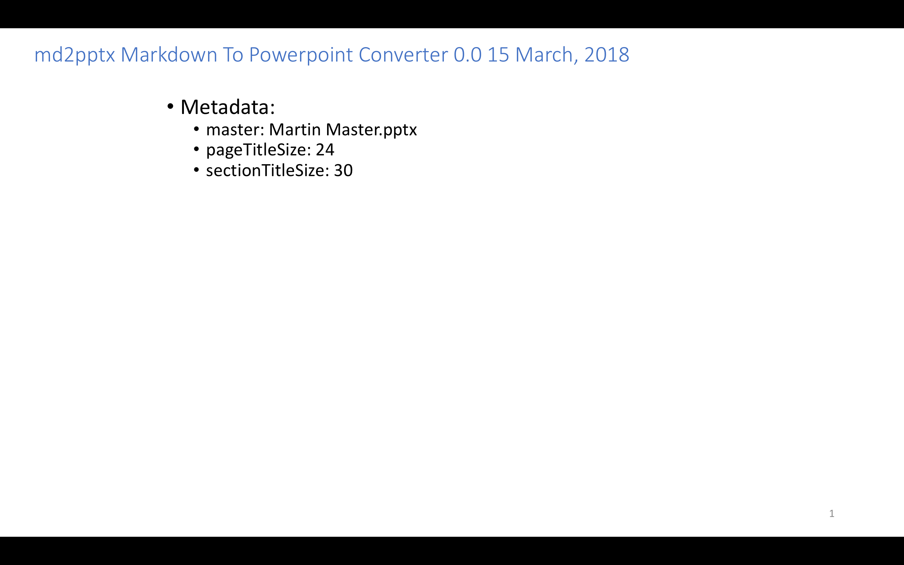
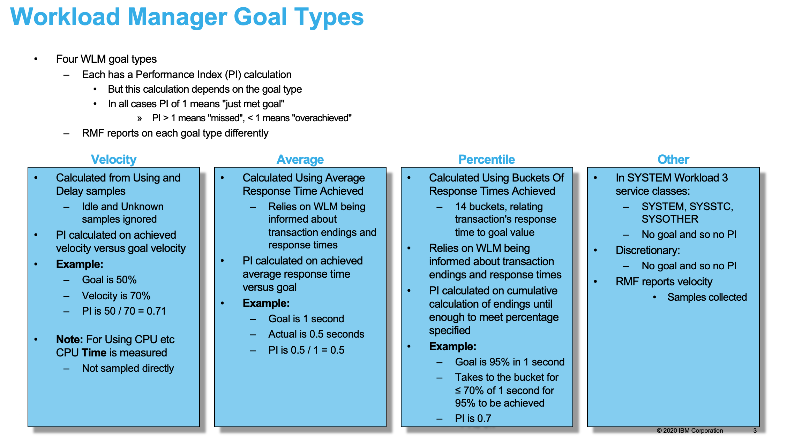
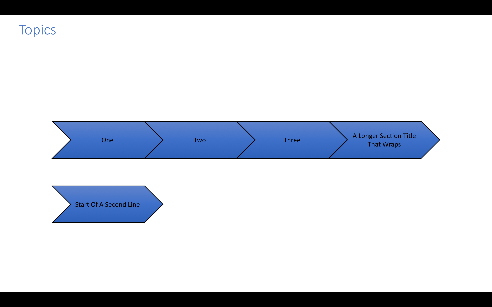
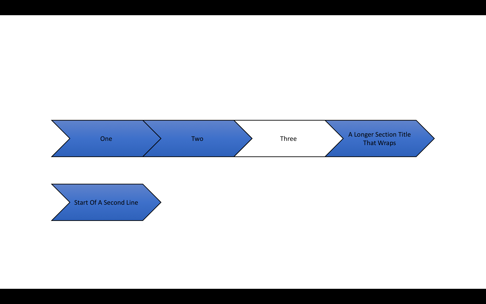

# Markdown To Powerpoint User Guide

This document describes the md2pptx Markdown preprocessor, which turns Markdown text into a Powerpoint pptx presentation.

In this document we'll refer to it as "md2pptx", pronounced "em dee to pee pee tee ex".

### Table Of Contents

* [Why md2pptx?](#why-md2pptx)
	* [A Real World Use Case](#a-real-world-use-case)
* [How Do You Use md2pptx?](#how-do-you-use-md2pptx)
	* [Installation](#installation)
	* [Use](#use)
* [python-pptx license](#pythonpptx-license)
* [Change Log](#change-log)
* [Creating Slides](#creating-slides)
	* [Presentation Title Slides](#presentation-title-slides)
	* [Presentation Section Slides](#presentation-section-slides)
	* [Bullet Slides](#bullet-slides)
		* [Numbered List Items](#numbered-list-items)
	* [Graphics Slides](#graphics-slides)
		* [Clickable Pictures](#clickable-pictures)
		* [Graphics File References](#graphics-file-references)
	* [Table Slides](#table-slides)
		* [Special Case: Two Graphics Side By Side](#special-case-two-graphics-side-by-side)
		* [Special Case: Two By Two Grid Of Graphics](#special-case-two-by-two-grid-of-graphics)
		* [Special Case: Three Graphics On A Slide](#special-case-three-graphics-on-a-slide)
		* [Special Case: One Graphic Above Another](#special-case-one-graphic-above-another)
	* [Card Slides](#card-slides)
	* [Code Slides](#code-slides)
		* [`<code>`](#<code>)
		* [Triple Backticks (```)](#triple-backticks-())
		* [Indented Text](#indented-text)
		* [`<pre>`](#<pre>)
	* [Task List Slides](#task-list-slides)
* [Slides Without Titles](#slides-without-titles)
	* [Using A Horizontal Rule](#using-a-horizontal-rule)
	* [Using A Level 3 Heading With `&nbsp;`](#using-a-level-3-heading-with-&nbsp;)
* [Hyperlinks](#hyperlinks)
	* [Coding A Heading Reference On A Target Slide](#coding-a-heading-reference-on-a-target-slide)
	* [Coding A Hyperlink To Another Slide](#coding-a-hyperlink-to-another-slide)
* [HTML Comments](#html-comments)
* [Special Text Formatting](#special-text-formatting)
	* [Using HTML `<style>` Elements To Specify Text Colours And Underlining](#using-html-<style>-elements-to-specify-text-colours-and-underlining)
	* [HTML Entity References](#html-entity-references)
	* [Numeric Character References](#numeric-character-references)
	* [Escaped Characters](#escaped-characters)
	* [CriticMarkup](#criticmarkup)
* [Creating A Glossary Of Terms](#creating-a-glossary-of-terms)
* [Creating Footnotes](#creating-footnotes)
	* [Creating A Footnote](#creating-a-footnote)
	* [Referring To A Footnote](#referring-to-a-footnote)
* [Controlling The Presentation With Metadata](#controlling-the-presentation-with-metadata)
	* [Specifying Metadata](#specifying-metadata)
	* [Metadata Keys](#metadata-keys)
		* [Slide Numbers - `numbers`](#slide-numbers-numbers)
		* [Page Title Size - `pageTitleSize`](#page-title-size-pagetitlesize)
		* [Section Title Size - `sectionTitleSize`](#section-title-size-sectiontitlesize)
		* [Section Subtitle Size - `sectionSubtitleSize`](#section-subtitle-size-sectionsubtitlesize)
		* [Monospace Font - `monoFont`](#monospace-font-monofont)
		* [Margin size - `marginBase` and `tableMargin`](#margin-size-marginbase-and-tablemargin)
		* [Associating A Class Name with A Background Colour With `style.bgcolor`](#associating-a-class-name-with-a-background-colour-with-stylebgcolor)
		* [Associating A Class Name with A Foreground Colour With `style.fgcolor`](#associating-a-class-name-with-a-foreground-colour-with-stylefgcolor)
		* [Associating A Class Name With Text Emphasis With `style.emphasis`](#associating-a-class-name-with-text-emphasis-with-styleemphasis)
		* [Template Presentation - `template`](#template-presentation-template)
		* ["Chevron Style" Table Of Contents - `tocStyle` And `tocTitle`](#chevron-style-table-of-contents-tocstyle-and-toctitle)
		* [Specifying An Abstract Slide With `abstractTitle`](#specifying-an-abstract-slide-with-abstracttitle)
		* [Specifying Text Size With `baseTextSize` And `baseTextDecrement`](#specifying-text-size-with-basetextsize-and-basetextdecrement)
		* [Specifying Bold And Italic Text Colour With `BoldColour` And `ItalicColour`](#specifying-bold-and-italic-text-colour-with-boldcolour-and-italiccolour)
		* [Specifying Bold And Italic Text Effects With `BoldBold` And `ItalicItalic`](#specifying-bold-and-italic-text-effects-with-boldbold-and-italicitalic)
		* [Shrinking Tables With `compactTables`](#shrinking-tables-with-compacttables)
		* [Controlling Task Slide Production With `taskSlides` and `tasksPerSlide`](#controlling-task-slide-production-with-taskslides-and-tasksperslide)
		* [Controlling Glossary Slide Production With `glossaryTitle`, `glossaryTerm`, `glossaryMeaning`,`glossaryMeaningWidth`, and `glossaryTermsPerPage`](#controlling-glossary-slide-production-with-glossarytitle-glossaryterm-glossarymeaningglossarymeaningwidth-and-glossarytermsperpage)
		* [Specifying How Much Space To Reserve For Slide Numbers With `NumbersHeight`](#specifying-how-much-space-to-reserve-for-slide-numbers-with-numbersheight)
		* [Card Slide Metadata](#card-slide-metadata)
			* [Card Background Colour - `CardColour`](#card-background-colour-cardcolour)
			* [Card Border Colour - `CardBorderColour`](#card-border-colour-cardbordercolour)
			* [Card Border Width - `CardBorderWidth`](#card-border-width-cardborderwidth)
			* [Card Title Size - `CardTitleSize`](#card-title-size-cardtitlesize)
			* [Card Shadow - `CardShadow`](#card-shadow-cardshadow)
			* [Card Size - `CardPercent`](#card-size-cardpercent)
			* [Card Layout Direction - `CardLayout`](#card-layout-direction-cardlayout)
			* [Card Title Alignment - `CardTitleAlign`](#card-title-alignment-cardtitlealign)
			* [Card Title Position - `CardTitlePosition`](#card-title-position-cardtitleposition)
			* [Card Shape - `CardShape`](#card-shape-cardshape)
	* [Code Slide Metadata](#code-slide-metadata)
		* [Code Column Count - `CodeColumns`](#code-column-count-codecolumns)
		* [Fixed Pitch Height To Width Ratio - `FPRatio`](#fixed-pitch-height-to-width-ratio-fpratio)
	* [Dynamic Metadata](#dynamic-metadata)
		* [`CompactTables`](#compacttables)
		* [`CardPercent`](#cardpercent)
		* [`CardLayout`](#cardlayout)
		* [`CardTitleAlign`](#cardtitlealign)
		* [`CardTitlePosition`](#cardtitleposition)
		* [`CardShape`](#cardshape)
		* [`PageTitleSize`](#pagetitlesize)
		* [`BaseTextSize`](#basetextsize)
		* [`BaseTextDecrement`](#basetextdecrement)
		* [`CodeColumns`](#codecolumns)
		* [`FPRatio`](#fpratio)
* [Modifying The Slide Template](#modifying-the-slide-template)
	* [Basics](#basics)
	* [Slide Template Sequence](#slide-template-sequence)
	* [Template Slide Types](#template-slide-types)
		* [Title Slide - `TitleSlideLayout`](#title-slide-titleslidelayout)
		* [Section Slide - `SectionSlideLayout`](#section-slide-sectionslidelayout)
		* [Title Only Slide - `TitleOnlyLayout`](#title-only-slide-titleonlylayout)
		* [Blank Slide - `BlankLayout`](#blank-slide-blanklayout)
		* [Content Slide - `ContentSlideLayout`](#content-slide-contentslidelayout)

## Why md2pptx?

There are advantages in creating presentations using a flat file format. Some of these are:

* You can use any text editor on any platform to create the file.
* Other tools can generate the file.

	For example, the author uses iThoughtsX on Mac, with its counterpart (iThoughts) on iOS, to generate presentations from outlines.

* Text editing tools are far quicker and more flexible that the Powerpoint presentation editor.
* Versioning and collaboration tools - such as git - are much easier to use with a text file than a Powerpoint presentation file.
* Other flat file formats can be embedded.

	With md2pptx you can use a simple Task Management format called [Taskpaper](https://support.omnigroup.com/omnifocus-taskpaper-reference/) to embed tasks. md2pptx will extract such tasks and generated a "Tasks" slide at the end of the presentation.

The flat file format that md2pptx uses is Markdown. Using Markdown has further advantages:

* The same text could be used to start, or even complete, a document of a different kind. Perhaps a long-form document.
* You can render the material in a web browser. Builds of this very documentation are checked that way.
* Markdown is easy to write.
* Markdown is compact; The files are tiny.
* Markdown is used in popular sites, such as [Github](https://github.com).

Every piece of text you use to create a Powerpoint presentation with md2pptx is valid Markdown. While it might not render exactly the same way put through another Markdown processor, it is generally equivalent. This is one of the key aims of md2pptx.

One final advantage of the md2pptx approach is you can generate presentations without using PowerPoint itself. Indeed you can create presentations on machines where PowerPoint won't even run. All you need is to be able to run Python 3 and install python-pptx.

### A Real World Use Case

The author developed a presentation over 10 years in Powerpoint and OpenOffice and LibreOffice. It became very inconsistent in formatting - fonts, colours, indentations, bullets, etc.. It was a horrible mess.

He took the trouble to convert it to Markdown and regenerated it with a very early version of md2pptx. The presentation looks nice again, with consistent formatting.

It was relatively little trouble to convert to Markdown. In fact it took about an hour to convert the 40 slide presentation. The consistency gain was automatic.

## How Do You Use md2pptx?

You write Markdown in exactly the same way as normal, with some understanding of how Markdown is converted to slides (using the information in [Creating Slides](#creating-slides)).

To use md2pptx you need to download it and install the prerequisites.

### Installation

To install md2pptx and its prerequisites

1. Have Python 3.8 or higher installed.
1. Install python-pptx using the command `pip3 install python-pptx`. (You might have to install pip firsst.)
1. Optionally install CairoSVG - using the command `pip3 install cairosvg`. (This is for SVG graphics support.)
1. Install md2pptx by copying a version and unzipping it or using `git clone`. md2pptx can be found [here](https://github.com/MartinPacker/md2pptx).

### Use


The following instructions are for Unix-like systems. (It's developed and used by the developer on Mac OS but should also have identical syntax on Linux.) Windows users will need a slightly different form, but the principle is the same.

Here is a sample invocation:

	md2pptx powerpoint-filename < markdown-filename

An alternative is to have the Markdown be in-stream. md2pptx reads from stdin. You can, of course, use stdin in a pipeline. Indeed the developer uses this to pipe from another program.
Alternatively, you can specify both an input file and an output file:

	md2pptx markdown-filename powerpoint-filename

If the input file doesn't exist md2pptx will terminate with a message. If the input file is empty the same thing will happen.

If you don't specify an input filename and don't redirect stdin md2pptx will await terminal input. This works but is probably only useful when experimenting with syntax with md2pptx.

Messages are written to stderr.

## python-pptx license

While [python-pptx](http://python-pptx.readthedocs.io/en/latest/) is not included in md2pptx it is used by it.

To quote from the python-pptx license statement:

	The MIT License (MIT)
	Copyright (c) 2013 Steve Canny, https://github.com/scanny

	Permission is hereby granted, free of charge, to any person obtaining a copy
	of this software and associated documentation files (the "Software"), to deal
	in the Software without restriction, including without limitation the rights
	to use, copy, modify, merge, publish, distribute, sublicense, and/or sell
	copies of the Software, and to permit persons to whom the Software is
	furnished to do so, subject to the following conditions:

	The above copyright notice and this permission notice shall be included in
	all copies or substantial portions of the Software.

	THE SOFTWARE IS PROVIDED "AS IS", WITHOUT WARRANTY OF ANY KIND, EXPRESS OR
	IMPLIED, INCLUDING BUT NOT LIMITED TO THE WARRANTIES OF MERCHANTABILITY,
	FITNESS FOR A PARTICULAR PURPOSE AND NONINFRINGEMENT. IN NO EVENT SHALL THE
	AUTHORS OR COPYRIGHT HOLDERS BE LIABLE FOR ANY CLAIM, DAMAGES OR OTHER
	LIABILITY, WHETHER IN AN ACTION OF CONTRACT, TORT OR OTHERWISE, ARISING FROM,
	OUT OF OR IN CONNECTION WITH THE SOFTWARE OR THE USE OR OTHER DEALINGS IN
	THE SOFTWARE.

## Change Log

|Level|Date|What|
|:-|-:|:-|
|1.9.3|21&nbsp;March&nbsp;2021|Added controls on how many columns wide code is and fixed pitch height to width ratio.|
|1.9.2|16&nbsp;March&nbsp;2021|Added `<pre>`&comma; `<code>`&comma; triple backtick - with `<span>` colouring for `<pre>`. Added ways to make a no-title slide.|
|1.9.1|6&nbsp;March&nbsp;2021|Added `&check;` entity reference. Reworked internals with more consistent layout and `getContentRec` and title formatting improvements. Prereq Python 3.8.|
|1.9|17&nbsp;February&nbsp;2021|Add support to specify which slide in master. Also numbersMargin|
|1.8.1|10&nbsp;February&nbsp;2021|Card options: Rounded versus square corners. Titles above or in cards|
|1.8|31&nbsp;January&nbsp;2021|SVG support for file and web graphics|
|1.7.2|24&nbsp;January&nbsp;2021|Make vertical bars optional around image references|
|1.7.1|11&nbsp;January&nbsp;2021|Fixed bug where hyperlinks in slide titles didn't work|
|1.7|9&nbsp;January&nbsp;2021|Added support for numbered list items|
|1.6.3|2&nbsp;January&nbsp;2021|Added support for vertical cards. Also new `CardTitleAlign` and `CardLayout` metadata&comma; plus `basetextsize` and `basetextdecrement` Dynamic Metadata items.|
|1.6.2|1&nbsp;January&nbsp;2021|Added 3 slide-level Dynamic Metadata capabilities and `cardpercent` metadata value.|
|1.6.1|29&nbsp;December&nbsp;2020|Added `<a id=` as an alternative hyperlink anchor.|
|1.6|22&nbsp;December&nbsp;2020|Added Card Slide support. Metadata keys are now case-insensitive.|
|1.5|7&nbsp;December&nbsp;2020|Pictures now can have a tooltip. You can define inter-slide links on both pictures and runs of text. You can omit the final `|` of a table line.|
|1.4|23&nbsp;November&nbsp;2020|Task slides' slide numbers are hyperlinked to the relevant slide|
|1.3|20&nbsp;November&nbsp;2020|Glossary terms now have tooltips and hyperlinks to the relevant Glossary slide. Footnotes have hyperlinks to the relevant Footnotes slide.|
|1.2|3&nbsp;November&nbsp;2020|Support URLs for graphics. Reworked Processing Summary slide to use a flowed table.|
|1.1|25&nbsp;October&nbsp;2020|Introduce Template as a better replacement for Master - which still works. Add German characters. Better template file searching. Escape underscore. Better handling of continuation onto second and subsequent lines.|
|1.0|13&nbsp;October&nbsp;2020|Python 3&comma; Support input filename as first command line parameter.|
|0.9|4&nbsp;September&nbsp;2020|Footnote slide support|
|0.8|14&nbsp;June&nbsp;2020|`bgcolor` is now `style.bgcolor`. Added `style.fgcolor` and `style.emphasis`.|
|0.7.3|24&nbsp;May&nbsp;2020|Allow background colouring via `span` elements|
|0.7.2|14&nbsp;April&nbsp;2020| Support three graphics on a slide. Added `&equals;` entity reference. Added `tableMargin`.|
|0.7.1|14&nbsp;November&nbsp;2019| Make slide titles longer. Fixed formatting issue with one-graphic-above-another table slide.|
|0.7|3&nbsp;November&nbsp;2019|Support `abbr` element as a glossary item. Each distinct term leads to a glossary slide entry at the back of the presentation.|
|0.6|8&nbsp;October&nbsp;2019|Support vertical pair of graphics in a table<br/>Fixed some issues with Markdown-syntax hyperlinks<br/>Support escaped square brackets `\[` and `\]`&comma;`&lsqb;` and `&rsqb;` being newly-supported alternatives|
|0.5|12&nbsp;May&nbsp;2019|CriticMarkup support|
|0.4.5|5&nbsp;May&nbsp;2019|Some numeric character references|
|0.4.4|6&nbsp;March&nbsp;2019|Processing summary slide shows build date and time|
|0.4.3|20&nbsp;January&nbsp;2019|Support a few HTML entity references - punctuation and arrows.<br/>Support split task slide sets - completed and incomplete.<br/>Task tags are sorted.|
|0.4.2|13&nbsp;January&nbsp;2019|Tasks slide set controllable with metadata `taskSlides` and `tasksPerSlide`|
|0.4.1|9&nbsp;January&nbsp;2019|Enhanced Taskpaper support with `@due`&comma; `@tags`&comma; and `@done`&comma; and reworked as a series of table slides.|
|0.4|7&nbsp;January&nbsp;2019|Support shrinking of table cell font and margins.<br/>Added two-to-by-two grid of graphics on a slide.|
|0.3.2|3 January 2019|Support \\# as a literal octothorpe/hash/pound.<br/>Tidied up reporting.<br/>Added superscript, subscript, strikethrough, and underline text effects.|
|0.3.1|3 November 2018|Fixed support for `<br/>` so it won't create a bullet on the new line.|
|0.3|22 October 2018|Added customisation for bold and italic text|
|0.2|3 September 2018|Added ways of controlling bullet sizes|
|0.1|1 April 2018|Initial Prototype|

## Creating Slides
<a id="creating-slides"></a>

Let's start with a simple example. Consider the following text.

	template: Martin Template.pptx
	pageTitleSize: 24
	sectionTitleSize: 30

	# This Is the Presentation Title Page

	## This Is A Section

	### This Is A Bullet Slide

	* Bullet One
	  * Sub-bullet A
	  * Sub-bullet B
	* Bullet Two
	* Bullet Three

You can try it if you like. Just cut it and paste it into a file. Call it something like Example.markdown.

It will render something like this:





The first slide is special, and an inevitable feature of using the python-pptx library. You will probably want to remove it before publishing.

Because the first slide has to be there md2pptx uses it to create a processing summary. The processing summary slide shows processing options, the time and date the presentation was created by md2pptx, and metadata.

Metadata is specified in the first three lines of this sample. In general metadata is the lines before the first blank line. It consists of key/value pairs, with the key separated from the value by a colon.

In this case the metadata specifies a number of things:

1. The Powerpoint file the presentation is based on is "hipodz.pptx".
1. Each slide with a title has a title font 22 points high.
1. Each presentation section slide has a title font 30 points high.
1. A number of other styling-related specifications.

All of the above are optional but you will almost certainly want to specify a template. Feel free to copy Martin Template.pptx - which is included with md2pptx -  and make stylistic changes.

For more on metadata see [Controlling The Presentation With Metadata](#controlling-the-presentation-with-metadata).

As you can see the format of each slide is fairly straightforward. How to code slides is described in the following sections.

### Presentation Title Slides
<a id="presentation-title-slides"></a>

You code a presentation title slide with a Markdown Heading Level 1:

	# This Is the Presentation Title Slide

If you type anything in subsequent lines - before a blank line - the text will appear as extra lines in the presentation title. You might use this, for example, to add the presentation authors' details.

### Presentation Section Slides

You code a presentation section slide with a Markdown Heading Level 2:

	## This Is A Section

You can code multiple lines, as with [Presentation Title slides](#presentation-title-slides).

### Bullet Slides
<a id="bullet-slides"></a>

Bullet slides use Markdown bulleted lists, which can be nested. This example shows two levels of nesting.

The title of the slide is defined by coding a Markdown Heading Level 3.


	### This Is A Bullet Slide

	* Bullet One
		* Sub-bullet A
		* Sub-bullet B
	* Bullet Two
	* Bullet Three

Bulleted list items are introduced by an asterisk.

**NOTE:** Some dialects of Markdown allow other bullet markers but md2pptx doesn't. You can be sure by coding `*` you have valid Markdown that md2pptx can also process correctly. For an explanation of why you have to stick to `*` see [here](#task-list-slides).

To nest bullets use a tab character or 2 spaces to indent the sub-bullets. md2pptx doesn't have a limit on the level of nesting but Powerpoint probably does.

Terminate the bulleted list slide with a blank line.

#### Numbered List Items
<a id="numbered-items"></a>

Within a bullet slide you can have numbered items. Here is an example of a slide with mixed numbers and bullets:

	### This Is A Mixed Numbers And Bullets Slide

	* Bullet One
		1. Numbered sub-bullet A
		1. Numbered sub-bullet B
	* Bullet Two
	* Bullet Three

Numbered list items are introduced with an integer, followed by a full stop.

Markdown takes care of the numbering. In the above example there are two numbered items. While the first will indeed be numbered "1" the second will be numbered "2", despite the `1.` coding.

Numbering with `1.` is actually a useful practice - as it makes it easier to reorder a numbered list (by moving the lines around).

**Note:** You can mix numbered and bulleted items in a list.

### Graphics Slides
<a id="graphics-slides"></a>

As with [bullet slides](#bullet-slides), code the slide title as a Markdown Heading Level 3. Specify the graphic to embed with the standard Markdown image reference:

	### A Graphic Slide

	

The graphic will be scaled to sensibly fill the slide area.

If you code a string inside the square brackets it will be used as a tooltip (or screentip, in Powerpoint parlance). In Presentation Mode, when you hover over the graphic the tooltip will be displayed. Here is an example:

	

**HINT:** If you want two graphics side by side use a single-row table, described [here](#special-case-two-graphics-side-by-side). If you want two graphics one above the other use a two-row, single-column table, described [here](#special-case-one-graphic-above-another).

#### Clickable Pictures
<a id="clickable-pictures"></a>

You can make a picture clickable, with an optional tooltip. This means you can click on a picture in slideshow mode to go to another slide. The tooltip is shown in slideshow mode when your mouse hovers over the picture.

Here's an example, showing both a tooltip and a clickable link.

    [](#sonic-highways)

Here the image reference is embedded in the clickable link:

* The tooltip text is `Foo Fighters Sonic Highways`.
* The picture's source is `https://upload.wikimedia.org/wikipedia/en/6/67/Foo_Fighters_8LP_Sonic_Highways.jpg`
* The target slide has the heading reference `sonic-highways`.

To create a hyperlink to a slide with heading reference code something like this as the title of that slide:

    ### My Slide’s Title [sonic-highways]

See [Hyperlinks](#hyperlinks) for more on creating hyperlinks.

#### Graphics File References
<a id="graphics-file-references"></a>

md2pptx supports graphics references in three different formats:

* A local file reference - ``
* A HTTP(S) reference - ``
* A `data:` URI reference - ``

The `data:` URI example actually works! Try it.

For cases other than the local file, the reference - when displayed by md2pptx - is shortened to show the beginning and the end of the reference. This is to make it easy to recognise if you've accidentally repeated the reference. Here is an example:

```
Slides:
=======

   1     Test Title                                           --> data:image/png;base64,/9j.../Nka02WcDC6hCtKgQhCAP/9k=
```

For image graphics only PNG and JPEG have been tested. While the code doesn't explicitly prohibit other image file types they aren't currently supported.

Scalable Vector Graphics (SVG) format is only supported if you have installed the CairoSVG Python package - as PowerPoint doesn't support it (and nor does python-pptx). SVG files - whether from the web or a local file - are converted to a temporary PNG file first, before copying into the PowerPoint slide deck.

SVG support uses the [CairoSVG](https://cairosvg.org/) library - which requires Python to be at least at the 3.6 level. md2pptx's SVG support is limited by that available in CairoSVG and so not all SVG files are supported.

If CairoSVG is not installed and md2pptx encounters an SVG graphic reference it will write a message reminding you of the need for CairoSVG. md2pptx will then immediately terminate.

### Table Slides
<a id="table-slides"></a>

You can create a table slide using Markdown's table format.

Code a title with a Markdown Heading Level 3. Then code a table. Here is a simple example of a table:

	|Left Heading|Centre Heading|Right Heading|
	|:----|:-:|--:|
	|Alpha|Bravo|1|
	|Charlie|Delta|2|

In this example there are three columns and three rows. The first row is the heading row. The third and fourth rows are data rows.

The second row controls the alignment of each column and their width:

* In the first column the leading colon denotes the text is to be left-justified.
* In the second column the colons either end denotes the text is to be centred.
* In the third column the trailing colon denotes the text is to be right-justified.
* According to the number of dashes the columns have widths in the ratio of 4 to 1 to 2.

In other Markdown processors the widths of the columns can't be specified in this way; The relative width specifications will be ignored.

Each cell can consist of text, which will wrap as necessary. You can't embed images in a table slide. But see [here](#special-case-two-graphics-side-by-side) and [here](#special-case-two-by-two-grid-of-graphics).

As a convenience, you can omit the final `|` on a line. While this isn't strictly Markdown compliant this might be helpful.

#### Special Case: Two Graphics Side By Side
<a id="special-case-two-graphics-side-by-side"></a>

The best Markdown fit for two graphics side by side is a single row table with two cells. md2pptx will "special case" such a table.

If you code something like this the two graphics will be placed next to each other:

	|||

A table won't be created in this case.

Don't code any headings or more than one row.

For the types of graphics supported see [Graphics File References](#graphics-file-references).

For how to make such graphics clickable or have a tooltip see [Clickable Pictures](#clickable-pictures).

**Note:** Regular Markdown processors don't support pictures in tables; They render the `|` characters literally. For this reason the vertical bars are optional.

#### Special Case: Two By Two Grid Of Graphics
<a id="special-case-two-by-two-grid-of-graphics"></a>

The best Markdown fit for four graphics on a slide is a two row table with two pairs of cells. md2pptx will "special case" such a table.

If you code something like this the four graphics will be placed in two rows of two:

	|||
	|||

A table won't be created in this case.

Don't code any headings or more than two rows.

To achieve the best result some margins around the graphics are reduced.

For the types of graphics supported see [Graphics File References](#graphics-file-references).

For how to make such graphics clickable or have a tooltip see [Clickable Pictures](#clickable-pictures).

**Note:** Regular Markdown processors don't support pictures in tables; They render the `|` characters literally. For this reason the vertical bars are optional.

#### Special Case: Three Graphics On A Slide
<a id="special-case-three-graphics-on-a-slide"></a>


The best Markdown fit for three graphics on a slide is a two row table&colon;

* The first row has two graphics.
* The second row has one graphic, centred in the row.

md2pptx will "special case" such a table.

If you code something like this the three graphics will be placed appropriately:

	|||
	||

Here the layout will be a "T".

A table won't be created in this case.

Don't code any headings or more than two rows.

To achieve the best result some margins around the graphics are reduced.

There are some variants on the above scheme. For example, if you code:

	||
	|||

Here the layout will be an inverted "T".

You can also force left alignment or right alignment of the sole graphic in a row. For example:

	|||
	|||

will align the sole top-row graphic to the left.

For the types of graphics supported see [Graphics File References](#graphics-file-references).

For how to make such graphics clickable or have a tooltip see [Clickable Pictures](#clickable-pictures).

**Note:** Regular Markdown processors don't support pictures in tables; They render the `|` characters literally. For this reason the vertical bars are optional.

#### Special Case: One Graphic Above Another
<a id="special-case-one-graphic-above-another"></a>


The best Markdown fit for two graphics, on above the other, on a slide is a two row table with a single cell in each row. md2pptx will "special case" such a table.

If you code something like this the two graphics will be placed in two rows of one:

	||
	||

A table won't be created in this case.

Don't code any headings or more than two rows.

For the types of graphics supported see [Graphics File References](#graphics-file-references).

For how to make such graphics clickable or have a tooltip see [Clickable Pictures](#clickable-pictures).

**Note:** Regular Markdown processors don't support pictures in tables; They render the `|` characters literally. For this reason the vertical bars are optional.

### Card Slides
<a id="card-slides"></a>

A card slide contains side-by-side panels - or cards. Each card has a title and, below that, the contents are defined using the same syntax as in [Bullet Slides](#bullet-slides). In fact this slide type is derivative of the Bullet Slide type.

A card slide can look something like this:



The key features of this slide are:

* A title, coded with Markdown Heading Level 3 syntax (`###`).
* An optional panel above the cards, coded using [Bullet Slides](#bullet-slides) syntax.
* A sequence of cards, coded one after the other but displayed side by side:
    * The title is coded using Markdown Heading Level 4 syntax (`####`).
    * The body of the card is coded using [Bullet Slides](#bullet-slides) syntax.

The width of each card is calculated depending on the number of cards. In this example the horizontal space is divided equally between the 4 cards.

In the above example there has been a small amount of tweaking of the format, using metadata. You can control the exact format using many tweaks:

* [Card Background Colour](#card-background-colour-cardcolour)
* [Card Border Colour](#card-border-colour-cardbordercolour)
* [Card Border Width](#card-border-width-cardborderwidth)
* [Card Title Font Size](#card-title-size-cardtitlesize)
* [Card Shadow](#card-shadow-cardshadow)
* [Card Size](#card-size-cardpercent)
* [Card Layout Direction](#card-layout-direction-cardlayout)
* [Card Title Alignment](#title-alignment-cardtitlealign)
* [Card Title Position](#card-title-position-cardtitleposition)
* [Card Shape](#card-shape-cardshape)

### Code Slides
<a id="code-slides"></a>

You can create a slide where the body is in a monospace font, without bullets, in a number of different ways:

* Where what you type appears exactly as you typed it - using `<code>`, triple backticks, or by indentation.
* Where what you type can be coloured, using `<pre>` and `<span>` elements, together with `style.fgcolor` etc specifications.

When we say "code", what you're displaying could be something like a terminal screen shot, of course. What's important is that it will be rendered in a fixed-pitch font.

In each case, the heading for the slide is generally introduced with heading level 3 - `### `. However you can start a slide without a heading. See [Slides Without Titles](#slides-without-titles) for how to do this.

**Note:** You can more precisely control how code slides are laid out with [Code Slide Metadata](#code-slide-metadata).

#### `<code>`

The HTML `<code>` element is supported. Surround the block of text by `<code>` and `</code`:

	### This Is A Code Slide

    <code>
    for(i = 0; i < 10; i++){
        alert(i)
    }
    </code>

**Note:** It, as in HTML, does not support `<span>` elements.

#### Triple Backticks (```)

Triple backticks are supported. Surround the block of text by them:

	### This Is A Code Slide

    ```
    for(i = 0; i < 10; i++){
        alert(i)
    }
    ```

**Note:** It does not support `<span>` elements.

#### Indented Text

Each line of the code fragment - to be displayed in a monospace font - is indented with 4 spaces:

	### This Is A Code Slide

	    for i in range(10):
	        print(i)

**Note:** It does not support `<span>` elements.

#### `<pre>`

The HTML `<pre>` element is supported. Surround the block of text by `<pre>` and `</pre`:

	### This Is A Code Slide

    <pre>
    for(i = 0; i < 10; i++){
        alert(i)
    }
    </pre>

**Note:** It, as in HTML, **does** support `<span>` elements. This is the best way to provide syntax colouring. You can use `style.fgcolor`, `style.bgcolor`, and `style.emphasis` to style the text. To do this you use the `class` attribute:

    <span class="keyword">for</span> (i = 0; i < 10; i ++)


### Task List Slides
<a id="task-list-slides"></a>

You can create tasks in a subset of the [Taskpaper](https://support.omnigroup.com/omnifocus-taskpaper-reference/) format by coding a line that starts with a `-`:

	- MARTIN: Complete The User Guide

If md2pptx detects any such tasks it removes them from the body of the presentation and adds them to a special set of "Tasks" slides at the end of the presentation. If no tasks are detected these slides are not created.

Taskpaper is a very flexible and simple text-based task management system. md2pptx parses anything after the `-` simplistically but doesn't invalidate the Taskpaper format:

* Anything after the `-` leading character and before the first `@` symbol, if any, is the task title.
* Anything bracketed by `@due(` and `)` is treated as a due date - but the date isn't actively parsed.
* Anything bracketed by `@tags(` and `)` is treated as a set of tags. Tags are separated by a space or a comma and they are sorted.
* Anything bracketed by `@done(` and `)` is treated as a completion date - but it isn't actively parsed. (An uncompleted task need not have anything in inside the bracket - or the `@done` could be missing.)

The task title, any due date, any tags, and any completion information, are added as a table row to the set of tasks.

Because of Taskpaper support you can't start a bullet with a `-`. So always start bulleted list items with a `*`.

Tasks on the Tasks slides are shown with the slide number they were coded on. If you click on the slide number you are taken to the corresponding slide.

Here's a more comprehensive example. Coding

	- Complete abstract @due(2019-01-11) @tags(Anna,Martin)

will cause a task to appear with title "Complete abstract", a due date of "2019-01-11", and tags "Anna,Martin". In this case the task has implicitly not been completed. (It would be possible to achieve the same effect by coding `@done()`.)

Task slides are paginated: Multiple task slides are created, each with the task slide number appended to the title, if there are more than a certain number of tasks.

You can control task slide production by specifying `taskSlides` and `tasksPerSlide`. See [Controlling Task Slide Production With `taskSlides` and `tasksPerSlide`](#controlling-task-slide-production-with-taskslides-and-tasksperslide).

## Slides Without Titles
<a id="slides-without-titles"></a>

Most slides have a title - and it's easy to see where such slides start. However, sometimes you want a slide without a title. For those cases you can start a slide in a two basic ways:

* Use a horizontal rule
* Use a level 3 heading with a non-breaking space:

The most likely use case is for code slides, though you might continue a bulleted-list slide this way.

### Using A Horizontal Rule

You can code a horizontal rule in a number of ways - which all Markdown processors should be able to handle:

* Code an HTML `<hr/>` element.
* Code a line starting with `***`, `---` or `___`. You can continue these as far to the right as you like.

Most of the time this is the technique you'll want to use but note other Markdown processors are likely to actually produce a horizontal rule.

### Using A Level 3 Heading With `&nbsp;`

Code the following on its own line:

    ### &nbsp;

This has the perhaps-useful side effect of not drawing a horizontal rule in most other Markdown processors.

## Hyperlinks
<a id="hyperlinks"></a>

To code a hyperlink to an **external** URL in a slide code something like:

	[IBM Website](http://www.ibm.com)

It will be rendered with the text "IBM Website" displayed: [IBM Website](http://www.ibm.com).
This above works for **external** references.
To create an internal slide reference you need to do two things:

1. Tag the heading of the target slide with a heading reference (href).
2. Code a reference to the target slide using the href.

### Coding A Heading Reference On A Target Slide
<a id="coding-a-heading-reference-on-a-target-slide"></a>

Multimarkdown and md2pptx support the following way of identifying a heading reference (href):

    ### z15 Processor Architecture [z15-arch]

    * 12 Cores Per PU Chip
        * Most of which are enabled
    * 4 PU Chips per drawer
    * 1-5 drawers per machine

The above is a slide with a title ("z15 Processor Architecture"). You can link to this slide using the href ("z15-arch").

An alternative method of specifying a target is like this:

    ### z15 Processor Architecture
    <a id="z15-arch"></a>

    * 12 Cores Per PU Chip
        * Most of which are enabled
    * 4 PU Chips per drawer
    * 1-5 drawers per machine

This method is provided because it is the only reliable within-a-document hyperlink target syntax that both GitHub and other Markdown processors support.

### Coding A Hyperlink To Another Slide
<a id="coding-a-hyperlink-to-another-slide"></a>

You can refer to the slide in a hyperlink using the href. Here's an example:

    ### Attributes Of A High Performance System

    * For how a high performance system is built see [here](#z15-arch)

* The bullet links to the slide with href `z15-arch`.
* You click on the word `here` in a presentation to move to the referred-to slide.

## HTML Comments
<a id="html-comments"></a>

You can use HTML-style comments, ranging over multiple lines.

Start the first line with `<!--`.

End the last line with `-->`.

md2pptx will throw away HTML comments, rather than adding them to the output file.

The one exception is the use of [Dynamic Metadata](#dynamic-metadata). md2pptx will honour these.

**NOTE:** Other Markdown processors will copy the comment into the output file. Put nothing in the comments that is sensitive.

## Special Text Formatting
<a id="special-text-formatting"></a>

Markdown and md2pptx allow additional ways of formatting text. The syntax md2pptx supports is a subset of what many Markdown processors allow.

To specify **bold** surround the text with pairs of asterisks - `**bold**`.

To specify *italics* surround the text with single asterisks - `*italics*`.

If you actually want an asterisk code either `\*` or the asterisk surrounded by spaces. (An asterisk at the end of a line need only have a preceding space.) Alternatively you can code an HTML entity reference - `&lowast;`.

If you actually want an octothorpe/hash/pound symbol (rendered "\#") code `\#`.

You can use bold and italics syntax to change the colour of highlighted text. See [here](#specifying-bold-and-italic-text-colour-with-boldcolour-and-italiccolour) for more.

To specify a `monospace font` use the back tick character - `` ` `` - at the start and end of the text run.

To force a line break code `<br/>`. This, being HTML, is legitimate in Markdown and will be treated as a line break. I don't want one here so I won't code one here.

Some other HTML-originated text effects work - as Markdown allows you to embed HTML (elements and attributes):

|Effect|HTML Element|Example|Produces|
|:-|-:|:-|:-|
|Superscript|`sup`|`x<sup>2</sup>`|x<sup>2</sup>|
|Subscript|`sub`|`C<sub>6</sub>H<sub>12</sub>O<sub>6</sub>`|C<sub>6</sub>H<sub>12</sub>O<sub>6</sub>|
|Underline|`ins`|`this is <ins>important</ins>`|this is <ins>important</ins>|
|Strikethrough|`del`|`this is <del>obsolete>/del>`|this is <del>obsolete</del>|

### Using HTML `<style>` Elements To Specify Text Colours And Underlining
<a id="using-html-style-elements-to-specify-text-colours-and-underlining"></a>

You can set the background or foreground colour of a piece of text. To do this use the `<span>` HTML element. Here is an example:

    I would like to highlight <span class="yellow">this bit</span> but not **this** bit.

In this example the `span` element specifies a `class` attribute. The class name must match one specified in the metadata using one of

* `style.bgcolor.` - described in <a href="#associating-a-class-name-with-a-background-colour-with-stylebgcolor">Associating A Class Name With A Background Colour With <code>style.bgcolor</code></a>.
* `style.fgcolor` - described in <a href="#associating-a-class-name-with-a-foreground-colour-with-stylefgcolor">Associating A Class Name With A Foreground Colour With <code>style.fgcolor</code></a>.
* `style.emphasis` - described in <a href="#associating-a-class-name-with-text-emphasis-with-styleemphasis">Associating A Class Name With Text Emphasis With <code>style.emphasis</code></a>.

If you coded metadata

    style.fgcolor.yellow: FFFF00

the result would be something like this:

I would like to highlight <span style="color: #FFFF00">this bit</span> but not **this** bit.


**Note:** A fragment of text in a span can't use any other text effect, such as bolding or italics.

The class name can be specified with double quotes, single quotes, or no quotes at all.

If you want to be able to process the text using a normal Markdown processor you can code Cascading Style Sheet (CSS) using the HTML `<style>` element. md2pptx will ignore any HTML after the metadata and before the first real Markdown text. For example:

	<style>
	.mytest{
	    text-decoration: underline;
	    color: #FF0000;
	    background-color: #FFFF00;
	    font-weight: bold;
	    font-style: italic;

	}
	</style>

The above uses only the style elements that md2pptx supports with `style.` metadata. It relies on you coding

	<span class="mytest">Here is some text</span>

for example - as it uses the class `mytest`.

### HTML Entity References
<a id="html-entity-references"></a>

md2pptx supports a few [HTML entity references](https://en.wikipedia.org/wiki/List_of_XML_and_HTML_character_entity_references)&colon;


|Entity Reference|Character|Entity Reference|Character|Entity Reference|Character|
|:-|-:|:-|:-|:-|:-|
|`&lt;`|&lt;|`&larr;`|&larr;|`&auml;`|&auml;|
|`&gt;`|&gt;|`&rarr;`|&rarr;|`&Auml;`|&Auml;|
|`&ge;`|&ge;|`&uarr;`|&uarr;|`&uuml;`|&uuml;|
|`&le;`|&le;|`&darr;`|&darr;|`&Uuml;`|&Uuml;|
|`&asymp;`|&asymp;|`&harr;`|&harr;|`&ouml;`|&ouml;|
|`&Delta;`|&Delta;|`&varr;`|&varr;|`&Ouml;`|&Ouml;|
|`&delta;`|&delta;|`&nearr;`|&nearr;|`&szlig;`|&szlig;|
|`&sim;`|&sim;|`&nwarr;`|&nwarr;|`&euro;`|&euro;|
|`&lowast;`|&lowast;|`&searr;`|&searr;|
|`&semi;`|&semi;|`&swarr;`|&swarr;|
|`&colon;`|&colon;|`&lsqb;`|&lsqb;|
|`&amp;`|&amp;|`&rsqb;`|&rsqb;|
|`&comma;`|&comma;|`&infin;`|&infin;|
|`&check;`|&check;|

### Numeric Character References
<a id="numeric-character-references"></a>

md2pptx supports a few [HTML numeric character references](https://en.wikipedia.org/wiki/Numeric_character_reference)&colon;

* Some like `&#223;` - with 3 or 4 numeric digits. (This produces the character '&#223;').
* Some like `&#x03A3;` - with 4 hexadecimal digits. (This produces the character '&#x03A3;').

(Some emoji work. For example you can paste 🦖 in to the source.)

###  Escaped Characters
<a id="escaped-characters"></a>

md2pptx supports a few escaped characters. Of most interest are the two square bracket characters:

* `\[`
* `\]`

You can also escape the underscore character:

* `\_`

### CriticMarkup
<a id="criticmarkup"></a>

md2pptx supports [CriticMarkup](http://criticmarkup.com/) for text. To quote from their home page:

>CriticMarkup is a way for authors and editors to track changes to documents in plain text. As with Markdown, small groups of distinctive characters allow you to highlight insertions, deletions, substitutions and comments, all without the overhead of heavy, proprietary office suites.

md2pptx supports all five markup elements. In common with other CriticMarkup processors, md2pptx shows the markup and merely colours the markup and marked up text appropriately:

* Insertion - `{++` and  `++}` - rendered in green.

    For example <span style="color:#00C300">`{++ This text was inserted ++}`</span>

* Deletion - `{--` and `--}` - rendered in red.

    For example <span style="color:#C30000">`{-- This text was deleted --}`</span>

* Comment - `{>>` and `<<}` - rendered in blue.

    For example <span style="color:#0000C3">`{>> This text is a comment <<}`</span>

* Replacement - `{~~`, `~>` `~~}` - rendered in orange.

    For example <span style="color:#FF8C00">`{~~old text~>replacement text~~}`</span>

* Highlight - `{==` and `==}` - rendered in purple.

    For example <span style="color:#C300C3">`{== This is a highlight ==}`</span>

In the above examples the deletions, insertions, replacements etc don't actually happen; They are just marked. Editing tools are needed to actually perform these actions, once the reviewer's comments have been accepted.

## Creating A Glossary Of Terms
<a id="creating-a-glossary-of-terms"></a>

You can use the HTML `abbr` element to generate a glossary entry. For example,

	<abbr title='British Broadcasting Corporation'>BBC</abbr>

In this example the glossary term is "BBC" and its definition is "British Broadcasting Corporation".

One or more Glossary Table slides will appear at the end of the presentation if any such terms are defined. When you create a glossary entry three things will happen:

* Both the term and its definition will appear in the glossary.
* The term will appear in the slide with the `abbr` element - with the appearance of a hyperlink element, which you can click on to get to the relevant Glossary slide.
* If you hover over the term for a second or two the definition of the term will appear as a tooltip.

If you define the term more than once only the first use will be included in the glossary. All uses of the term will appear in the normal slides.

Each Glossary Table slide comprises two columns: A narrow column with the terms (or acronyms), and a wider column with their definitions (or meanings).

In Glossary Table slides the definitions are sorted alphabetically, upper case before lower case.

If you use the `abbr` HTML element most markdown processors will treat it as HTML and hovering over the term will reveal the definition.
However, while md2pptx can cope with e.g. `<br/>` elements in a glossary definition most markdown processors can't.

You can control various aspects of the glossary's appearance using metadata. How to is described [here](#controlling-glossary-slide-production-with-glossarytitle-glossaryterm-glossarymeaningglossarymeaningwidth-and-glossarytermsperpage).

Because md2pptx's support uses hyperlinks you might want to adjust your template so that taken hyperlinks are the same colour as not-yet-taken ones.
This is something md2pptx can't do for you.
You can change these colours under "Themes" in the Slide Master editor.

## Creating Footnotes
<a id="creating-footnotes"></a>

You can create and reference footnotes.

### Creating A Footnote
<a id="creating-a-footnote"></a>

To define a footnote code `[^name]: ` on a new line. The remainder of the line will be the footnote text.

If you have defined footnotes one or more Footnotes slides will be added to the end of the presentation.

Footnotes are automatically numbered, starting with 1.

### Referring To A Footnote
<a id="referring-to-a-footnote"></a>

To refer to a footnote code `[^name]`. The footnote's number (automatically generated) will appear like so:

&nbsp;&nbsp;&nbsp;&nbsp;This is a footnote reference<sup><u>4</u></sup>.

If the name doesn't match a footnote a question mark will be printed instead of the footnote number.

If you click on a footnote number you will be taken to the appropriate Footnotes slide.

## Controlling The Presentation With Metadata
<a id="controlling-the-presentation-with-metadata"></a>

You can control some aspects of md2pptx's processing using metadata.

### Specifying Metadata
<a id="specifying-metadata"></a>

You specify metadata in the lines before the first blank line. It consists of key/value pairs, with the key separated from the value by a colon.
Keys are case insensitive. In this User Guide they are capitalised to aid comprehension. For example, `baseTextDecrement` is treated the same as `basetextdecrement`.

While some Markdown processors handle metadata, most ignore it. Conversely, while md2pptx will print **all** the metadata it encounters on the first slide (if the template presentation contains at least 1 slide), it will practically ignore metadata it doesn't understand.

### Metadata Keys
<a id="metadata-keys"></a>

The following sections describe each of the metadata keys.

#### Slide Numbers - `numbers`
<a id="slide-numbers-numbers"></a>

md2pptx can add slide numbers. These are generated by md2pptx itself (or hardcoded) and are not the same as ones you can turn on in a footer.

The default value is `no`. You can turn them on for all slides with `yes` or non-title slides with `content`.

Example:

	numbers: yes

#### Page Title Size - `pageTitleSize`
<a id="page-title-size-pagetitlesize"></a>

You can specify the point size of each slide that isn't a section divider or title slide. The size is specified in points.

Example:

	pageTitleSize: 24

The default is 30 points.

You can override this value on a slide-by-slide basis with [Dynamic PageTitleSize](#pagetitlesize-dynamic).

#### Section Title Size - `sectionTitleSize`
<a id="section-title-size-sectiontitlesize"></a>

You can specify the point size of the title text for each slide that's a section divider or title slide. The size is specified in points.

Example:

	sectionTitleSize: 42

The default is 40 points.

#### Section Subtitle Size - `sectionSubtitleSize`
<a id="section-subtitle-size-sectionsubtitlesize"></a>

You can specify the point size of the subtitle text for each slide that's a section divider or title slide. The size is specified in points.

The subtitle text is the second and subsequent lines of the title - generally a separate text shape on the slide.

Example:

	sectionSubtitleSize: 24

The default is 28 points.

#### Monospace Font - `monoFont`
<a id="monospace-font-monofont"></a>

You can specify which font to use for monospaced text - such as on [code slides](#code-slides).

Example:

	monoFont: Arial

The default is Courier.

#### Margin size - `marginBase` and `tableMargin`
<a id="margin-size-marginbase-and-tablemargin"></a>

You can increase or decrease the margin around things - in decimal fractions of an inch.

For a table you can specify the left and right margins using `tableMargin`.
For everything else use `marginBase`.

Example:

	marginBase: 0.5

The default is 0.2 (inches).

#### Associating A Class Name with A Background Colour With `style.bgcolor`
<a id="associating-a-class-name-with-a-background-color-with-style-bgcolor"></a>

You can use HTML `<span>` elements to set the background colour, as described in <a href="#using-html-ltstylegt-elements-to-specify-text-colours-and-underlining">Using HTML &lt;style&gt; Elements To Specify Text Colours And Underlining</a>.

Here is an example:

    style.bgcolor.yellow: FFFF00

In this example the class "yellow" is associated with a background colour, defined in RGB terms as hexadecimal FFFF00, which is:

* 255 of red
* 255 of green
* 0 of blue

which is in fact yellow.

#### Associating A Class Name with A Foreground Colour With `style.fgcolor`
<a id="associating-a-class-name-with-a-foreground-color-with-style-fgcolor"></a>

You can use HTML `<span>` elements to set the foreground colour, as described in <a href="#using-html-ltstylegt-elements-to-specify-text-colours-and-underlining">Using HTML &lt;style&gt; Elements To Specify Text Colours And Underlining</a>.

Here is an example:

    style.fgcolor.red: FF0000

In this example the class "red" is associated with a foreground colour, defined in RGB terms as hexadecimal FF0000, which is:

* 255 of red
* 0 of green
* 0 of blue

which is in fact red.

#### Associating A Class Name With Text Emphasis With `style.emphasis`
<a id="associating-a-class-name-with-text-emphasis-with-style-emphasis"></a>

You can use HTML `<span>` elements to bold text, make it italic, or underline it - as described in <a href="#using-html-ltstylegt-elements-to-specify-text-colours-and-underlining">Using HTML &lt;style&gt; Elements To Specify Text Colours And Underlining</a>.

Here is an example:

    style.emphasis.important: bold underline

In this example the class "important" is associated with bolding the text and underlining it.

You can also use `italic`.

As the example shows, separate the emphasis attributes with a space.

#### Template Presentation - `template`
<a id="template-presentation-template"></a>

You can specify a different template file to create the presentation from than the one supplied with python-pptx. The one supplied with md2pptx is a very good one to work from:

	template: Martin Template.pptx

If you want to create your own template you probably want to take Martin Template.pptx and modify it. See [Modifying The Slide Template](modifying-the-slide-template) for more information on how to do so.

(For compatibility purposes, you can continue to use `master` instead of `template`. It's probably better practice, though, to use `template`.)

Templates are searched for in the following sequence:

1. Using the name as given. For example `hipodz.pptx` will search the current directory.
2. In the md2pptx installation directory.

#### "Chevron Style" Table Of Contents - `tocStyle` And `tocTitle`
<a id="chevron-style-table-of-contents-tocstyle-and-toctitle"></a>

If you have a Table Of Contents slide - with each section title listed as a top level bullet you can create a "Chevron Style" Table Of Contents slide. It will look something like this:



If your Table Of Contents slide's title is "Topics" you need only code

	tocStyle: chevron

If your Table Of Contents slide's title is something else you need to additionally code something like

	tocTitle: Agenda

If you specify `tocStyle: chevron` the section headings will be rendered something like this:



Here the section is highlighted by removing the background.

**NOTES:**

* Ensure only one slide has the same title as the Table Of Contents slide. Otherwise md2pptx will attempt to render the other slides as if they were a Table Of Contents slide.
* Ensure the section slides' titles are unique. Otherwise more than one chevron will be highlighted on the relevant section slide.

#### Specifying An Abstract Slide With `abstractTitle`
<a id="specifying-an-abstract-slide-with-abstracttitle"></a>

You can arrange for a single-level bulleted list slide to be formatted specially - as an abstract.

Instead of each list item having a bullet, it is treated as a paragraph. This is more appropriate for an abstract slide. (An extra blank paragraph is added between each paragraph - to space it out.)

To indicate an abstract slide code

	abstractTitle: Abstract

Any slide with the title matching the value of abstractTitle will be rendered as an abstract slide.

#### Specifying Text Size With `baseTextSize` And `baseTextDecrement`
<a id="specifying-text-size-with-basetextsize-and-basetextdecrement"></a>

You can control the size of text - in table slides, code slides, and bulleted list slides - with two metadata tags: `baseTextSize` And `baseTextDecrement`.
If you don't specify `baseTextSize` the base presentation's font sizes are used.

If you specify a `baseTextSize` value code, tables, and the top-level bullet use this size, which is specified in points.
Further, if you specify `baseTextDecrement` each successive level of bullets' font size is decremented by this number of points.
The default for `baseTextDecrement` is 2 points.

For example, if you code

	baseTextSize: 20
	baseTextDecrement: 1

the top-level bullet uses a 20 point font, the next level down a 19 point font, and so on.

If you just coded

	baseTextSize: 20

the top-level bullet uses a 20 point font, the next level down a 18 point font, and so on.

You can specify these dynamically. See [here](#basetextsize-dynamic) and [here](#basetextdecrement-dynamic). You might want to do this to fine tune a particularly sparse or crowded page.

#### Specifying Bold And Italic Text Colour With `BoldColour` And `ItalicColour`
<a id="specifying-bold-and-italic-text-colour-with-boldcolour-and-italiccolour"></a>

You can modify how md2pptx formats bold and italic colours:

* To specify the colour of bold text use `BoldColour` (or `BoldColor`).
* To specify the colour of italic text use `ItalicColour` (or `ItalicColor`).

For example:

	BoldColour: ACCENT 1

Will cause text marked like so `**I am bold**` to be rendered in the presentation's smartmaster's "Accent 1" colour.

The values you can use for `BoldColour` and `ItalicColour` are:

* NONE
* ACCENT 1
* ACCENT 2
* ACCENT 3
* ACCENT 4
* ACCENT 5
* ACCENT 6
* BACKGROUND 1
* BACKGROUND 2
* DARK 1
* DARK 2
* FOLLOWED HYPERLINK
* HYPERLINK
* LIGHT 1
* LIGHT 2
* TEXT 1
* TEXT 2
* MIXED

As you can probably guess, these are standard values for python-pptx and, ultimately, PowerPoint.

**Note:** For the values you can use any capitalisation you like (or none). e.g. `ItalicColor: dark 1`.

#### Specifying Bold And Italic Text Effects With `BoldBold` And `ItalicItalic`
<a id="specifying-bold-and-italic-text-effects-with-boldbold-and-italicitalic"></a>

You can modify how md2pptx formats bold and italic text.

If you don't want bold text to actually be bold code

	BoldBold: no

If you don't want italic text to actually be italic code

	ItalicItalic: no

The default for both of these is, of course, `yes` so that bold text is bold and italic text is italic.

These options were added so that `BoldColour` and `ItalicColour` could just become colour effects. See [here](#specifying-bold-and-italic-text-colour-with-boldcolour-and-italiccolour).

#### Shrinking Tables With `compactTables`
<a id="shrinking-tables-with-compacttables"></a>

You can reduce the size of a table on the slide with `compactTables`. If you specify a value larger than 0 two things will happen:

* The font will use whatever point size you specify.
* The margins around the text in a cell will be reduced to 0.

For example, to remove the margins and reduce the font size to 16pt code

    compactTables: 16

You can override this value with [Dynamic Metadata](#compacttables-dynamic).

#### Controlling Task Slide Production With `taskSlides` and `tasksPerSlide`
<a id="controlling-task-slide-production-with-taskslides-and-tasksperslide"></a>

Before unleashing your presentation on the world you probably want to remove the Task List slides from it. You can control what tasks are shown, if any, with `taskSlides`. It can take four different values:

* `all` (the default) which shows both complete and incomplete tasks.
* `none` which hides the task list slides altogether.
* `done` which shows completed tasks only.
* `remaining` which shows only tasks that haven't been completed.
* `separate` which separates the tasks into slides with completed tasks and slides with incomplete tasks.

A completed task is one where the `@done` attribute has been coded with something inside the brackets. An incomplete task is one where either the `@done` attribute wasn't coded or there is nothing inside the brackets.

For example, to suppress all task slides code

	taskSlides: none

Though you wouldn't normally need to do this, you can control how many tasks appear on a slide with `tasksPerSlide`. For example, coding

	tasksPerSlide: 10

will limit the numberof tasks on a slide to 10. The default is 20 tasks per slide.

#### Controlling Glossary Slide Production With `glossaryTitle`, `glossaryTerm`, `glossaryMeaning`,`glossaryMeaningWidth`, and `glossaryTermsPerPage`
<a id="controlling-glossary-slide-production-with=glossarytitle-glossaryterm-glossarymeaning-glossarymeaningwidth-and-glossarytermsperpage"></a>

[Creating A Glossary Of Terms](#creating-a-glossary-of-terms) describes how you can use the `abbr` element to generate a glossary of terms.

You can control various aspects of the appearance of the Glossary Slide(s) using the following metadata items.

For example, coding

	glossaryTitle: Definitions

will cause the Glossary Slide title to be "Definitions". The default is "Glossary".

Coding

	glossaryTerm: Acronym

will cause the first heading of the table in the Glossary Slide to be "Acronym". The default is "Term".

Coding

	glossaryMeaning: Definition

will cause the second heading of the table in the Glossary Slide to be "Definition". The default is "Meaning".

Coding

	glossaryMeaningWidth: 3

will cause the width of the second column in the table to be three times that of the first column.

Coding

	glossaryTermsPerPage: 10

will cause the maximum number of glossary items on a Glossary slide to be 10. If there are more terms, a second slide will be created. And so on. The default is 20.

#### Specifying How Much Space To Reserve For Slide Numbers With `NumbersHeight`

You can override the default space left at the bottom of the slides - for slide numbers or maybe a custom footer:

    NumbersHeight: 1.0

This specifies to reserve 1.0 inches of vertical space. The default is 0.4 inches.

#### Card Slide Metadata
##### Card Background Colour - `CardColour`
<a id="card-background-colour-cardcolour"></a>

You can specify which of the theme colours to use for the background of each card in a [Card Slide](#card-slides) - using `CardColour` (or `CardColor`). For example:

    CardColour: BACKGROUND 2

If you don't specify this the default text box background colour - from the template - will be used.

##### Card Border Colour - `CardBorderColour`
<a id="card-border-colour-cardbordercolour"></a>

You can specify which of the theme colours to use for the border of each card in a [Card Slide](#card-slides) - using `CardBorderColour` (or `CardBorderColor`).For example:

    CardBorderColour: TEXT 1

If you don't specify this the cards won't have a border.

##### Card Border Width - `CardBorderWidth`
<a id="card-border-width-cardborderwidth"></a>

You can specify the thickness of the border (in points) of each card in a [Card Slide](#card-slides) - using `CardBorderWidth`. For example:

    CardBorderWidth: 1

If you don't specify this the cards will use the default text box border width - from the template.

##### Card Title Size - `CardTitleSize`
<a id="card-title-size-cardtitlesize"></a>

You can specify the size of the font (in points) for the cards' title - using `CardTitleSize`. For example:

    CardTitleSize: 15

If you don't specify this the card titles will be 2/3 the size of the slide's title.

#####  Card Shadow - `CardShadow`
<a id="card-shadow-cardshadow"></a>

You can specify whether a card has a shadow - using `CardShadow`. For example:

    CardShadow: yes

If you don't specify this the cards won't have a shadow - unless the default text box style is to have a shadow.

<a id="card-size-cardpercent"></a>
##### Card Size - `CardPercent`

You can control the vertical space used by cards - as a percentage of the content area. The default is 80%.

Here is an example:

    CardPercent: 70

You can override this value on a slide-by-slide basis with [Dynamic CardPercent](#cardpercent-dynamic).

<a id="card-layout-direction-cardlayout"></a>
##### Card Layout Direction - `CardLayout`

By default md2pptx lays out cards across the slide. This is called "horizontal layout" - and is generally a good use of slide space. But it's not what many Markdown processors do with Heading Level 4 (`####`). They tend to lay out vertically, even though this is generally a poorer use of slide "real estate".

To specify horizontal card layout code:

    CardLayout: horizontal

To specify vertical card layout code:

    CardLayout: vertical

You can override this value on a slide-by-slide basis with [Dynamic CardLayout](#cardlayout-dynamic).

<a id="card-title-alignment-cardtitlealign"></a>
##### Card Title Alignment - `CardTitleAlign`

By default md2pptx centres card titles above the corresponding card. Generally this looks best for the horizontal card layout.You can override this - perhaps to make titles on a vertical card layout slide left aligned.

To specify left card title alignment code:

    CardTitleAlign: left

You can specify `left`, `right`, or `center` or `centre`. You can abbreviate these to `l`, `r`, or `c`.

You can override this value on a slide-by-slide basis with [Dynamic CardTitleAlign](#cardtitlealign-dynamic).

<a id="card-title-position-cardtitleposition"></a>
##### Card Title Position - `CardTitlePosition`

By default md2pptx places each card's title above the card body. You can override this.

To specify the cards' titles will be inside the card body, at the top, code:

    CardTitlePosition: inside

The default value is `above`.

You can override this value on a slide-by-slide basis with [Dynamic CardTitlePosition](#cardtitleposition-dynamic).

<a id="card-shape-cardshape"></a>
##### Card Shape - `CardShape`

By default md2pptx renders each card with a rounded card body. You can override this.

To specify the cards' bodies will be squared off, at the top, code:

    CardShape: squared

The default value is `rounded`.

You can override this value on a slide-by-slide basis with [Dynamic CardShape](#cardshape-dynamic).

<a id="code-slide-metadata"></>
### Code Slide Metadata

You can adjust how code slides display their content.

<a id="code-column-count-codecolumns"></a>
#### Code Column Count - `CodeColumns`

You can adjust how wide the text box the code is displayed in using `CodeColumns`. For example:

    CodeColumns: 70

The default value is 80.


You can override this on a slide-by-slide basis with [Dynamic CodeColumns](#dynamic-codecolumns).

<a id="fixed-pitch-height-to-width-ration-fpratio"></a>
####  Fixed Pitch Height To Width Ratio - `FPRatio`

md2pptx assumes the height of a column is 1.2 times its width. You can adjust this ratio with `FPRatio`:

    FPRatio: 1.1

You can override this on a slide-by-slide basis with [Dynamic FPRatio](#dynamic-fpratio).

<a id="dynamic-metadata"></a>
### Dynamic Metadata


md2pptx can alter some in-effect settings, starting at a particular slide. Straight after the heading code a special form of comment like so:

    ### Origins Of Mainframe, Performance, Topics Podcast
    <!-- md2pptx: compacttables: 14 -->

The use of `md2pptx:` in the comment tells md2pptx there is a Dynamic Metadata statement embedded in the comment.

Here are the values you can specify for the metadata:

* `pres` - revert to the presentations's value (if specified). If, at the beginning of the presentation, you didn't specify a value for this metadata item it will be the md2pptx default that will be in effect.
* `default` - revert to the md2pptx default.
* Any other value - used literally.

If you dynamically change a metadata value the new value will remain in effect for the remainder of the presentation, unless changed again.

**Note:** After tweaking a slide you might well want to revert to your presentation's overall value (or even the md2pptx default).

<a id="compacttables-dynamic"></a>
#### `CompactTables`

You can override the presentation [CompactTables](#shrinking-tables-with-compacttables) metadata value - perhaps to decrease the font size for a particularly crowded table slide:

    <!-- md2pptx: compacttables: 12 -->

<a id="cardpercent-dynamic"></a>
#### `CardPercent`

You can override the presentation [CardPercent](#card-size-cardpercent) metadata value - perhaps to allow room for more card content:

    <!-- md2pptx: cardpercent: 90 -->

<a id="cardlayout-dynamic"></a>
#### `CardLayout`

You can override the presentation [CardLayout](#card-layout-direction-cardlayout) metadata value - perhaps to make an individual card slide vertical when most are horizontal:

Either `vertical` or `horizontal` can be specified.

    <!-- md2pptx: cardlayout: vertical -->

<a id="cardtitlealign-dynamic"></a>
#### `CardTitleAlign`

You can override the presentation [CardTitleAlign](#card-title-alignment-cardtitlealign) metadata value - perhaps to make an individual card slide's titles left-aligned when most are centred:

    <!-- md2pptx: cardtitlealign: l -->

<a id="cardtitleposition-dynamic"></a>
#### `CardTitlePosition`

You can override the presentation [CardTitlePosition](#card-title-position-cardtitleposition) metadata value - perhaps to make an individual card slide's titles inside the cards when most are above:

    <!-- md2pptx: cardtitleposition: insde -->

<a id="cardshape-dynamic"></a>
#### `CardShape`

You can override the presentation [CardShape](#card-shape-cardshape) metadata value - perhaps to make an individual card slide's cards have square corners when most are rounded:

    <!-- md2pptx: cardshape: squared -->

<a id="pagetitlesize-dynamic"></a>
#### `PageTitleSize`

You can override the presentation [PageTitleSize](#page-title-size-pagetitlesize) metadata value - perhaps to allow room for more text in the title of a slide:

    <!-- md2pptx: pagetitlesize: 16 -->

<a id="basetextsize-dynamic"></a>
#### `BaseTextSize`

You can override the presentation [BaseTextSize](#specifying-text-size-with-basetextsize-and-basetextdecrement) metadata value. For example:

    <!-- md2pptx: basetextsize: 16 -->

The above makes the top-level bullets smaller than you would normally see - perhaps to cram in more bullets.

<a id="basetextdecrement-dynamic"></a>
#### `BaseTextDecrement`

You can override the presentation [BaseTextDecrement](#specifying-text-size-with-basetextsize-and-basetextdecrement) metadata value. For example:

    <!-- md2pptx: basetextdecrement: 0 -->

The above stops each level of bullets having progressively smaller text.

<a id="dynamic-codecolumns"></a>

#### `CodeColumns`

You can override the presentation [CodeColumns](#code-column-count-codecolumns) metadata value. For example:

    <!-- md2pptx: codecolumns: 60 -->

The above changes the `CodeColumns` value for this and subsequent slides to 60.

<a id="dynamic-fpratio"></a>

#### `FPRatio`

You can override the presentation [FPRatio](#fixed-pitch-height-to-width-ration-fpratio) (fixed pitch font character height to width ratio) metadata value. For example:

    <!-- md2pptx: fpratio: 1.3 -->

The above changes the `FPRatio` value for this and subsequent slides to 1.3.

## Modifying The Slide Template
<a id="modifying-the-slide-template"></a>

The included template presentation - Martin Template.pptx - is what the author tested with and gives good results. However, you probably want to develop your own template from it.

This section is a basic introduction to the rules of the game for doing so.

### Basics
<a id="basics"></a>

It's best not to change the order of the slides in the slide master view and not to delete any elements. If you have a slide template presentation where the necessary slides are in the wrong order you can override where md2pptx picks its slides from. See the table below for metadata items to specify different template slides i.e override what md2pptx expects. Here's an example:

```
BlankLayout: 14
```

In this example, the slide in the template presentation to use for blank slides is number 14, with 0 being the first.

It's probably also not useful to add elements. Take care with moving and resizing elements; It's probably best to experiment to see what effects you get.

### Slide Template Sequence
<a id="slide-template-sequence"></a>

The following table shows how each slide type is created.

|Slide Type|Origin|Metadata<br/>Override|Non-Title Content|
|:-|-:|:-|:-|
|Processing Summary|Original slide from Template||Metadata: Second Shape|
|Presentation Title|Slide Layout 0|TitleSlideLayout|Subtitle: Second Shape|
|Section|Slide Layout 1|SectionSlideLayout|Subtitle: Second Shape|
|Graphic With Title|Slide Layout 5|TitleOnlyLayout|Graphic: New Shape|
|Graphic Without Title|Slide Layout 6|BlankLayout|Graphic: New Shape|
|Code|Slide Layout 5|TitleOnlyLayout|Code: New Shape|
|Content|Slide Layout 2|ContentSlideLayout|Bulleted List: Second Shape|
|Table|Slide Layout 5|TitleOnlyLayout|Table: New Shape|
|Tasks|Slide Layout 2|ContentSlideLayout| Bulleted List: Second Shape|

**Notes:**

1. When looking for a title md2pptx looks first for a title shape and, failing that, uses the first shape. It's the Template Designer's responsibility to size and position it sensibly.
2. "New Shape" means md2pptx will create a new shape with, hopefully, sensible position and size.
3. With "Second Shape" it's the Template Designer's responsibility to size and position it sensibly.

### Template Slide Types

The following sections give a brief description of each slide type md2pptx builds a presentation from. Your template presentation should have a slide of each type.

The title of each section includes the metadata override for that type of template slide.

#### Title Slide - `TitleSlideLayout`

This is for the presentation's overall title. It probably has a title text line half way down the slide - though other designs are possible.

Generally you would use a Heading Level 1 (`#`) to create such a slide.

#### Section Slide - `SectionSlideLayout`

This is for a section within the presentation - and is generally simpler than the presentation title slide. It probably has a title text line half way down the slide - though other designs are possible.

Generally you would use a Heading Level 2 (`##`) to create such a slide.

#### Title Only Slide - `TitleOnlyLayout`

This is used where there will be some content below a title - and md2pptx doesn't use any content that might already be on the slide.

####  Blank Slide - `BlankLayout`

This is where md2pptx wants to create a slide without using any content from the template slide.

#### Content Slide - `ContentSlideLayout`

This is where md2pptx wants to reuse e.g. a text area. It is expected the template slide will have a title shape.
